# Monitoramento de Infraestrutura — Nginx, Prometheus e Grafana

Ambiente distribuído com **balanceamento de carga** (Nginx) entre dois servidores de aplicação e **observabilidade** (Prometheus + Grafana). Este README é o passo a passo de tudo o que foi feito, na ordem em que foi feito, e serve de roteiro para reproduzir o ambiente e para a demonstração ao professor.

## Sumário

1. [Arquitetura](#arquitetura)
2. [Ambiente: VMs, IPs, portas e versões](#ambiente)
3. [Como ler este guia](#como-ler-este-guia)
4. [Etapa 1 — Criar a VM1 no VirtualBox](#etapa-1--criar-a-vm1-no-virtualbox)
5. [Etapa 2 — Configurar a VM1 (lb)](#etapa-2--configurar-a-vm1-lb)
6. [Etapa 3 — Clonar a VM2 (srv-a) e a VM3 (srv-b)](#etapa-3--clonar-a-vm2-srv-a-e-a-vm3-srv-b)
7. [Etapa 4 — Aplicação nos servidores A e B](#etapa-4--aplicação-nos-servidores-a-e-b)
8. [Roteiro de demonstração ao professor](#roteiro-de-demonstração-ao-professor)
9. [Decisões técnicas (perguntas prováveis)](#decisões-técnicas-perguntas-prováveis)
10. [Dificuldades e soluções](#dificuldades-e-soluções)
11. [Próximas etapas](#próximas-etapas)

---

## Arquitetura

```
                 ┌──────────────────── PC (host) 192.168.56.1 ────────────────────┐
                 │   Prometheus  ·  Grafana  ·  gerador de carga  ·  SSH / Git    │
                 └───────────────────────────────┬────────────────────────────────┘
                                                 │  rede host-only 192.168.56.0/24
              ┌──────────────────────────────────┼──────────────────────────────────┐
              │                                  │                                  │
     ┌────────┴────────┐               ┌─────────┴────────┐               ┌─────────┴────────┐
     │ VM1  lb         │               │ VM2  srv-a       │               │ VM3  srv-b       │
     │ 192.168.56.10   │──── HTTP ────►│ 192.168.56.11    │               │ 192.168.56.12    │
     │ Nginx balancead.│──── HTTP ─────┼──────────────────┼──────────────►│                  │
     └─────────────────┘               │ Nginx → app      │               │ Nginx → app      │
                                       │ 127.0.0.1:5000   │               │ 127.0.0.1:5000   │
                                       └──────────────────┘               └──────────────────┘
```

Fluxo de uma requisição: **cliente → Nginx do `lb` → Nginx do `srv-a` ou `srv-b` (alternando) → aplicação local em `127.0.0.1:5000`**.

---

## Ambiente

### Máquinas virtuais

| VM  | Hostname | Papel             | IP host-only  | vCPU | RAM     | Disco |
|-----|----------|-------------------|---------------|------|---------|-------|
| VM1 | `lb`     | Nginx balanceador | 192.168.56.10 | 1    | 1024 MB | 10 GB |
| VM2 | `srv-a`  | Servidor A        | 192.168.56.11 | 1    | 1024 MB | 10 GB |
| VM3 | `srv-b`  | Servidor B        | 192.168.56.12 | 1    | 1024 MB | 10 GB |
| PC  | —        | Host (Prometheus, Grafana, carga) | 192.168.56.1 | — | — | — |

### Rede de cada VM

| Interface | Adaptador VirtualBox | Modo      | Endereço              | Função |
|-----------|----------------------|-----------|-----------------------|--------|
| `enp0s3`  | Adapter 1            | NAT       | 10.0.2.15 (DHCP)      | Internet (instalar pacotes) |
| `enp0s8`  | Adapter 2            | Host-only | 192.168.56.1x (fixo)  | VMs ↔ VMs e VMs ↔ PC |

### Portas

| Serviço   | Onde         | Escuta em        | Quem acessa |
|-----------|--------------|------------------|-------------|
| SSH       | todas as VMs | `0.0.0.0:22`     | PC (administração) |
| Aplicação | srv-a, srv-b | `127.0.0.1:5000` | Somente a própria VM (Nginx local) |

### Versões

| Software      | Versão |
|---------------|--------|
| Hypervisor    | Oracle VirtualBox |
| Sistema       | Ubuntu Server 26.04.1 LTS |
| Kernel        | 7.0.0-34-generic |
| Python        | 3.14.4 |
| curl          | 8.18.0 |
| Usuário admin | `ram` |

### Estrutura do repositório

```
monitoramento-nginx/
├── README.md            # este passo a passo
├── GUIA.md              # comandos e conceitos explicados (estudo)
├── lb/netplan.yaml      # rede da VM1
├── srv-a/netplan.yaml   # rede da VM2
├── srv-b/netplan.yaml   # rede da VM3
├── app/
│   ├── app.py           # aplicação dos servidores A e B
│   └── app.service      # serviço systemd da aplicação
└── docs/prints/         # evidências (capturas de tela)
```

---

## Como ler este guia

Cada passo começa dizendo **onde** o comando é executado:

| Marcação | Significa |
|----------|-----------|
| 🖥️ **PC** | Terminal do computador local (fora das VMs) |
| 🧰 **VirtualBox** | Interface gráfica do VirtualBox |
| 📦 **VM `nome`** | Terminal dentro da VM, pela janela do VirtualBox ou via `ssh ram@IP` |

> **Dica:** o prompt mostra em qual máquina você está (`ram@lb`, `ram@srv-a`, `ram@srv-b`). Confira antes de cada comando.

---

## Etapa 1 — Criar a VM1 no VirtualBox

### 1.1 Conferir a rede host-only

🧰 **VirtualBox** → *File → Tools → Network Manager* → aba *Host-only Networks*

- Deve existir uma rede (ex.: `vboxnet0`) com o IP **192.168.56.1/24**. Esse é o IP do PC nessa rede.
- Na aba *DHCP Server*, a faixa padrão é **.101 a .254**. Os IPs fixos das VMs (.10, .11, .12) ficam **fora** dela, para não haver conflito.

### 1.2 Criar a VM1

🧰 **VirtualBox** → *New*

| Campo | Valor |
|-------|-------|
| Nome | `lb` |
| ISO | Ubuntu Server 26.04.1 LTS |
| OS Version | detectado pela ISO (na dúvida: *Ubuntu (64-bit)*) |
| Memória / CPU / Disco | 1024 MB / 1 vCPU / 10 GB |

*Settings → Network*:
- **Adapter 1:** NAT
- **Adapter 2:** Host-only Adapter → `vboxnet0`

### 1.3 Instalar o Ubuntu Server

📦 **VM `lb`** (janela do VirtualBox, instalador)

- Rede: deixar as duas placas em DHCP (o IP fixo é configurado depois).
- Marcar **Install OpenSSH server**.
- Não instalar snaps extras.
- Usuário: `ram`.

> ⚠️ Instalar **uma VM por vez**. Com as três instalando juntas e 1 GB cada, o instalador falhou (ver [Dificuldades](#dificuldades-e-soluções)).

---

## Etapa 2 — Configurar a VM1 (lb)

### 2.1 Atualizar o sistema

📦 **VM `lb`**
```bash
sudo apt update          # baixa a lista de versões disponíveis
sudo apt upgrade -y      # instala as atualizações
```

### 2.2 Definir o hostname

📦 **VM `lb`**
```bash
sudo hostnamectl set-hostname lb
sudo nano /etc/hosts     # trocar o nome antigo na linha 127.0.1.1 por: lb
```
Salvar no nano: `Ctrl+O`, Enter, `Ctrl+X`.

### 2.3 Configurar IP fixo na host-only

📦 **VM `lb`**
```bash
ls /etc/netplan/                                    # mostra 00-installer-config.yaml
sudo nano /etc/netplan/00-installer-config.yaml     # caminho COMPLETO
```
Conteúdo (indentação com espaços, nunca TAB):
```yaml
network:
  version: 2
  ethernets:
    enp0s3:              # NAT: continua automático e traz a rota para a internet
      dhcp4: true
    enp0s8:              # host-only: IP fixo, sem gateway
      dhcp4: false
      addresses:
        - 192.168.56.10/24
```
```bash
sudo chmod 600 /etc/netplan/00-installer-config.yaml   # netplan exige que só o root leia
sudo netplan try                                       # aplica; Enter para confirmar (desfaz sozinho em 120 s se não confirmar)
ip -4 addr show enp0s8                                 # deve mostrar 192.168.56.10/24
ping -c 3 google.com                                   # internet continua funcionando pela NAT
```

### 2.4 Acessar por SSH a partir do PC

🖥️ **PC**
```bash
ping -c 3 192.168.56.10
ssh ram@192.168.56.10          # "yes" na primeira vez
```
A partir daqui, todo o trabalho nas VMs é feito por SSH (copiar/colar, rolagem).

### 2.5 Ativar o firewall

📦 **VM `lb`** (via SSH)
```bash
sudo ufw allow OpenSSH         # libera a porta 22 ANTES de ativar
sudo ufw enable                # responder "y"
sudo ufw status verbose
```
**Resultado:** entrada bloqueada por padrão, exceto 22/tcp; saída liberada; ativo no boot.

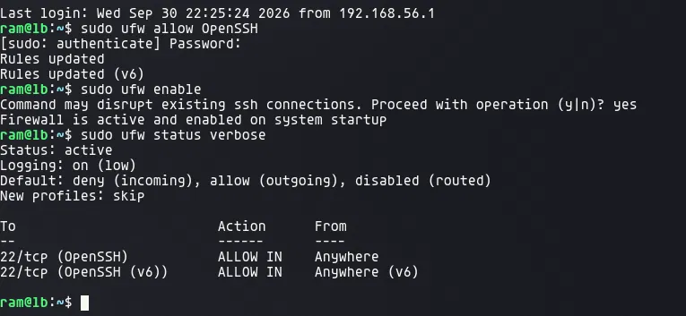

### 2.6 Reiniciar e conferir se tudo persistiu

📦 **VM `lb`**
```bash
sudo reboot
```
🖥️ **PC** → reconectar com `ssh ram@192.168.56.10` e rodar:
```bash
hostnamectl                    # Static hostname: lb
ip -4 addr show enp0s8         # 192.168.56.10/24, valid_lft forever (= IP fixo)
```

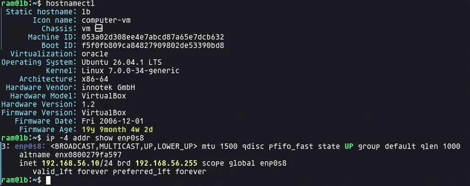

### 2.7 Versionar a configuração de rede

📦 **VM `lb`** — o arquivo só é legível pelo root, então copiar para a home primeiro:
```bash
sudo cp /etc/netplan/00-installer-config.yaml ~/ && sudo chown $USER ~/00-installer-config.yaml
exit
```
🖥️ **PC** (na pasta do repositório)
```bash
mkdir -p lb
scp ram@192.168.56.10:~/00-installer-config.yaml lb/netplan.yaml
git add .
git commit -m "chore: config de rede da VM1"
git push
```

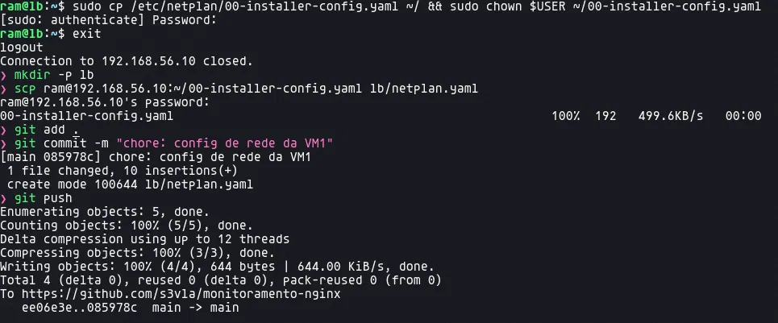

---

## Etapa 3 — Clonar a VM2 (srv-a) e a VM3 (srv-b)

A VM1 já estava instalada, atualizada e com firewall; clonar evita refazer tudo. Mas o clone sai **idêntico**, então tudo que identifica a máquina precisa ser trocado.

### 3.1 Clonar

📦 **VM `lb`**: `sudo poweroff`

🧰 **VirtualBox** → botão direito na `lb` → *Clone*

| Campo | Valor |
|-------|-------|
| Nome | `srv-a` (depois repetir com `srv-b`) |
| MAC Address Policy | **Generate new MAC addresses for all network adapters** |
| Tipo | **Full clone** |

### 3.2 Ajustar cada clone

📦 **VM `srv-a`** pela **janela do VirtualBox** (não por SSH), **com a `lb` desligada**: o clone liga com o mesmo IP `.10` dela.

```bash
# nome
sudo hostnamectl set-hostname srv-a
sudo nano /etc/hosts                              # 127.0.1.1 lb → srv-a

# machine-id (identificador único da instalação)
sudo rm -f /etc/machine-id /var/lib/dbus/machine-id
sudo systemd-machine-id-setup
sudo ln -sf /etc/machine-id /var/lib/dbus/machine-id

# chaves SSH do servidor
sudo rm /etc/ssh/ssh_host_*
sudo dpkg-reconfigure openssh-server

# IP fixo
sudo nano /etc/netplan/00-installer-config.yaml   # trocar .10 por .11
sudo netplan apply
sudo reboot
```
📦 **VM `srv-b`**: mesmos comandos, com `srv-b` e IP `.12`.

| Item         | lb (original) | srv-a | srv-b |
|--------------|---------------|-------|-------|
| Hostname     | lb            | srv-a | srv-b |
| IP host-only | .10           | .11   | .12   |
| MAC          | original      | novo  | novo  |
| machine-id   | original      | novo  | novo  |
| Chaves SSH   | originais     | novas | novas |

O firewall veio clonado com o SSH já liberado.

### 3.3 Limpar as chaves SSH antigas no PC

Como as chaves dos servidores mudaram, o PC bloqueia a conexão com **REMOTE HOST IDENTIFICATION HAS CHANGED**:

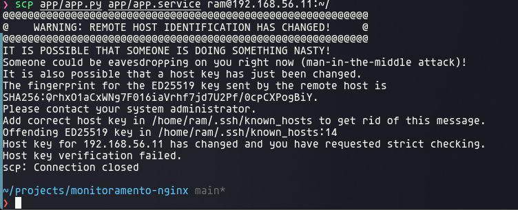

🖥️ **PC**
```bash
ssh-keygen -R 192.168.56.11    # apaga a chave antiga guardada para esse IP
ssh-keygen -R 192.168.56.12
```
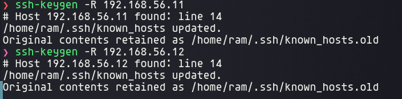

Na próxima conexão, responder `yes` para aceitar a chave nova.

### 3.4 Verificar a comunicação entre as VMs

📦 **VM `srv-a`** (com as três VMs ligadas)
```bash
ping -c 2 192.168.56.10
ping -c 2 192.168.56.11
ping -c 2 192.168.56.12
```

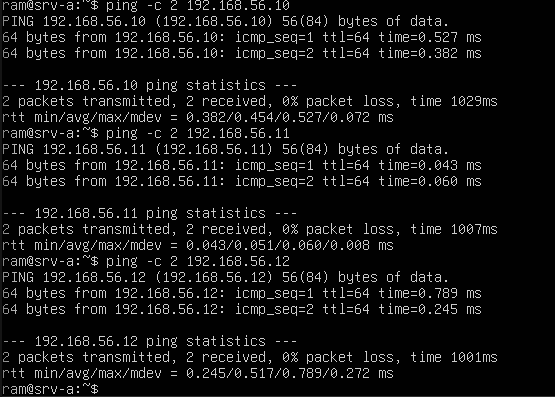

| Destino | Perda | Tempo médio | Leitura |
|---------|-------|-------------|---------|
| .10 (lb)    | 0% | ~0,45 ms | alcança o balanceador |
| .11 (srv-a) | 0% | ~0,05 ms | ela mesma: o pacote não sai da máquina |
| .12 (srv-b) | 0% | ~0,52 ms | alcança o outro servidor |

`ttl=64` sem decréscimo = nenhum roteador no caminho; as três estão na mesma rede.

### 3.5 Versionar as configurações de rede

📦 **VM `srv-a`** e 📦 **VM `srv-b`** (cada uma)
```bash
sudo cp /etc/netplan/00-installer-config.yaml ~/ && sudo chown $USER ~/00-installer-config.yaml
```
🖥️ **PC**
```bash
mkdir -p srv-a srv-b
scp ram@192.168.56.11:~/00-installer-config.yaml srv-a/netplan.yaml
scp ram@192.168.56.12:~/00-installer-config.yaml srv-b/netplan.yaml
git add . && git commit -m "chore: config de rede da VM2 e VM3" && git push
```

---

## Etapa 4 — Aplicação nos servidores A e B

### O que é a aplicação

Python 3, só biblioteca padrão (`http.server`): já vem no Ubuntu, nada para instalar. **O mesmo `app.py` roda nas duas VMs**; o nome muda pela variável `APP_NAME` no serviço.

| Rota | Resposta | Para quê |
|------|----------|----------|
| `/` | servidor, hostname, data e hora | Ver qual instância respondeu (alternância do balanceamento) |
| `/health` | `"status": "ok"` | Verificação de saúde |
| `/carga?n=300000` | quantidade de primos até `n` e tempo gasto | Gerar consumo de CPU nos testes de carga |

**Rota de carga:** conta números primos testando divisões, de propósito ineficiente e só de CPU. O `n` controla a intensidade (padrão 50 mil, teto 2 milhões para não travar a VM). Permite provocar aumento de CPU e de tempo de resposta de forma controlada e repetível, visível no Grafana.

**Por que só em `127.0.0.1`:** a porta 5000 não existe para a rede. Só o Nginx da própria VM alcança a aplicação, via `proxy_pass`.

### 4.1 Enviar os arquivos para as VMs

🖥️ **PC** (na pasta do repositório)
```bash
scp app/app.py app/app.service ram@192.168.56.11:~/
scp app/app.py app/app.service ram@192.168.56.12:~/
```

### 4.2 Instalar como serviço

📦 **VM `srv-a`** e depois 📦 **VM `srv-b`**
```bash
sudo mkdir -p /opt/app
sudo mv ~/app.py /opt/app/
sudo mv ~/app.service /etc/systemd/system/
sudo nano /etc/systemd/system/app.service   # SÓ no srv-b: trocar para "APP_NAME=Servidor B"
sudo systemctl daemon-reload                # faz o systemd ler o arquivo novo
sudo systemctl enable --now app             # liga agora e em todo boot
systemctl status app --no-pager             # deve mostrar active (running)
```

`/etc/systemd/system/app.service`:

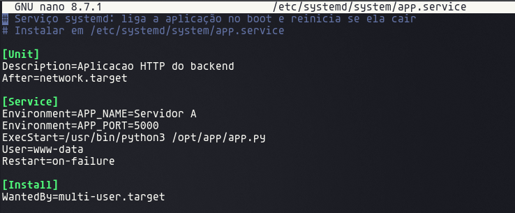

| Linha | Função |
|-------|--------|
| `After=network.target` | Só sobe depois da rede |
| `Environment="APP_NAME=Servidor A"` | Nome que aparece na resposta (**com aspas**, por causa do espaço) |
| `Environment="APP_PORT=5000"` | Porta interna |
| `ExecStart=/usr/bin/python3 /opt/app/app.py` | Comando que inicia a aplicação |
| `User=www-data` | Roda sem privilégios de root |
| `Restart=on-failure` | Religa sozinha se cair |
| `WantedBy=multi-user.target` | Sobe em todo boot (ativado pelo `enable`) |

### 4.3 Testar localmente

📦 **VM `srv-a`** e 📦 **VM `srv-b`** (dentro de cada uma; `127.0.0.1` é a própria VM)
```bash
curl http://127.0.0.1:5000/
curl http://127.0.0.1:5000/health
curl "http://127.0.0.1:5000/carga?n=300000"
ss -tlnp | grep 5000
```

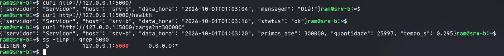

- As três rotas respondem; `/carga` com 300 mil levou ~0,3 s.
- `ss` mostra **`127.0.0.1:5000`** (só loopback), e não `0.0.0.0:5000` (todas as interfaces).

*Essa print é anterior à correção das aspas no serviço (o nome saía só "Servidor"). Depois da correção:*

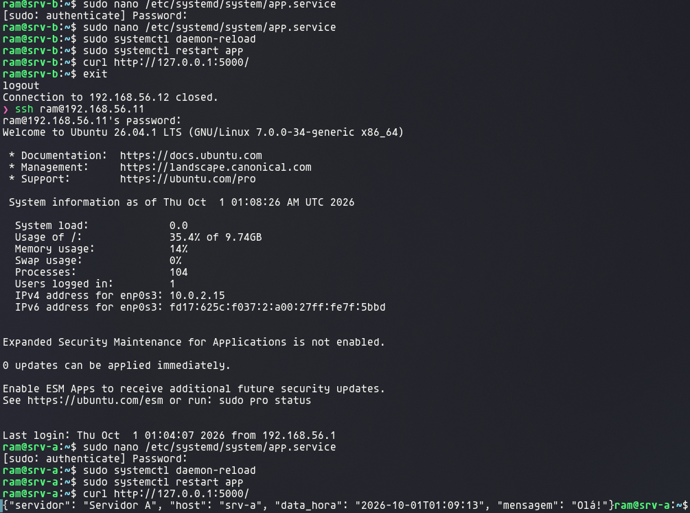
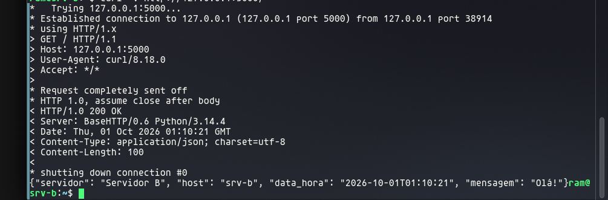

### 4.4 Provar que a porta 5000 não é acessível pela rede

| Onde rodar | Comando | Resultado esperado | Motivo |
|------------|---------|--------------------|--------|
| 📦 **VM `srv-a`** | `curl --max-time 3 http://192.168.56.11:5000/` | `Could not connect` (imediato) | Nada escuta no IP de rede `.11:5000`, só no `127.0.0.1:5000`: conexão **recusada** |
| 📦 **VM `srv-b`** | `curl --max-time 3 http://192.168.56.11:5000/` | `Connection timed out after 3000 ms` | O firewall do `srv-a` **descarta** o pacote sem responder |
| 🖥️ **PC** | `curl --max-time 3 http://192.168.56.11:5000/` | `Connection timed out after 3000 ms` | Igual ao anterior: firewall descarta |

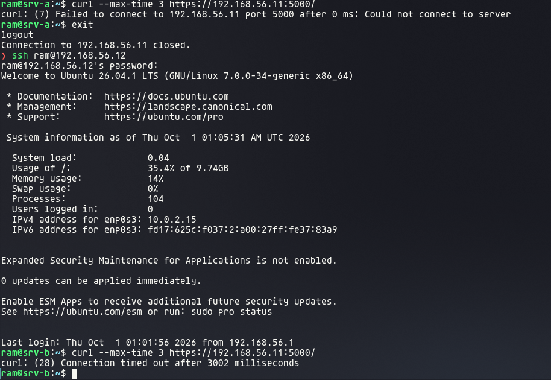

São **duas camadas de proteção**: a aplicação só escuta no loopback **e** o firewall bloqueia a porta. Mesmo que uma falhasse, a outra impediria o acesso.

> Usar `http://`, não `https://`: a aplicação não tem certificado.

---

## Roteiro de demonstração ao professor

Ordem sugerida, com tudo ligado. Cada linha diz **onde** rodar e **o que dizer**.

### A. Infraestrutura

| # | Onde rodar | Comando | Mostrar / explicar |
|---|------------|---------|--------------------|
| 1 | 🧰 VirtualBox | *Settings → Network* de uma VM | Duas placas: NAT (internet) e host-only (rede do projeto) |
| 2 | 🖥️ PC | `ip -4 addr` | O PC tem `192.168.56.1` na placa host-only: é por ela que o Prometheus vai coletar |
| 3 | 🖥️ PC | `ping -c 2 192.168.56.10` (e `.11`, `.12`) | O PC alcança as três VMs |
| 4 | 📦 VM `srv-a` | `ping -c 2 192.168.56.10` e `.12` | As VMs se comunicam entre si; `ttl=64` = mesma rede |
| 5 | 📦 qualquer VM | `hostnamectl` | Hostname e versão do sistema |
| 6 | 📦 qualquer VM | `ip -4 addr show enp0s8` | IP fixo (`valid_lft forever`) |
| 7 | 📦 qualquer VM | `sudo ufw status verbose` | Entrada bloqueada por padrão; só o necessário liberado |

### B. Aplicação

| # | Onde rodar | Comando | Mostrar / explicar |
|---|------------|---------|--------------------|
| 8  | 📦 VM `srv-a` | `curl http://127.0.0.1:5000/` | Responde "Servidor A" com data e hora |
| 9  | 📦 VM `srv-b` | `curl http://127.0.0.1:5000/` | Responde "Servidor B" (mesmo código, outra variável) |
| 10 | 📦 VM `srv-a` | `curl http://127.0.0.1:5000/health` | Rota de saúde |
| 11 | 📦 VM `srv-a` | `curl "http://127.0.0.1:5000/carga?n=1000000"` | Tempo maior que no `/`: a rota gera carga de CPU controlada |
| 12 | 📦 VM `srv-a` | `ss -tlnp \| grep 5000` | Escuta só em `127.0.0.1` |
| 13 | 🖥️ **PC** | `curl --max-time 3 http://192.168.56.11:5000/` | **Falha** (timeout): a porta interna não é acessível pela rede |
| 14 | 📦 VM `srv-a` | `systemctl status app --no-pager` | Roda como serviço: sobe no boot, religa se cair |

### C. Repositório

| # | Onde | O que mostrar |
|---|------|---------------|
| 15 | GitHub | Histórico de commits (uma etapa por commit) e as pastas `lb/`, `srv-a/`, `srv-b/`, `app/` com as configs |

---

## Decisões técnicas (perguntas prováveis)

**Por que NAT + host-only, e não bridge?**
A host-only é uma rede só entre o PC e as VMs, com IPs que não dependem do roteador de casa ou da faculdade: o ambiente funciona igual em qualquer lugar. As VMs também não ficam expostas na rede local. A NAT serve apenas para a VM acessar a internet.

**Por que IP fixo?**
Os IPs vão no `upstream` do Nginx e no `prometheus.yml`. Se mudassem (DHCP), essas configurações quebrariam. Ficam fora da faixa DHCP para não haver conflito.

**Por que a host-only não tem gateway no netplan?**
Uma máquina deve ter uma única rota padrão. Ela já vem pela NAT (DHCP), que é a única com saída para a internet.

**Por que 1 vCPU e 1 GB?**
Suficiente para Nginx, aplicação e exporters. Com 1 vCPU, a rota de carga satura a CPU rapidamente e o efeito fica visível nos gráficos. `srv-a` e `srv-b` são idênticas para a comparação do balanceamento ser justa.

**Por que Ubuntu Server sem interface gráfica?**
Consome menos CPU e RAM, e as métricas refletem só os serviços do projeto.

**Por que clonar e o que foi trocado?**
Para não repetir a instalação. Foram trocados MAC (conflito de rede), hostname, machine-id (identificador único da instalação), chaves SSH (identidade do servidor) e IP.

**Por que a aplicação em Python sem framework?**
Já vem no Ubuntu, sem dependências. Atende a todas as rotas pedidas com um arquivo só.

**Por que systemd?**
A aplicação sobe sozinha no boot, religa se cair e roda com um usuário sem privilégios (`www-data`).

**Como vocês provam que a porta 5000 não é acessível?**
`ss` mostra que ela escuta só em `127.0.0.1`, e o `curl` de fora (PC ou outra VM) falha por timeout, porque o firewall descarta o pacote.

---

## Dificuldades e soluções

| Problema | Causa | Solução |
|----------|-------|---------|
| Instalação falhou (`configure_apt`, "An error occurred") | Três VMs instalando ao mesmo tempo com 1 GB | Instalar uma por vez |
| "Já existe uma VM com esse nome" ao recriar | VM removida com *Remove only*: a pasta ficou no disco | Apagar a pasta em *Preferences → Default Machine Folder* |
| Interfaces confundidas | — | NAT = `10.0.2.x`; host-only = `192.168.56.x` (padrões do VirtualBox) |
| nano abriu vazio / "is a directory" | Caminho sem o nome do arquivo, ou só o nome sem a pasta | Usar o caminho completo; Tab para completar |
| `mv README.md GUIA.md` sobrescreveu um arquivo | Sem destino, o `mv` renomeia | O último argumento é sempre o destino (`.` = pasta atual) |
| REMOTE HOST IDENTIFICATION HAS CHANGED | Chaves SSH regeneradas no clone; PC guardava a antiga | `ssh-keygen -R IP` no PC |
| App instalada no `lb` por engano | Terminal conectado na VM errada | Conferir o hostname no prompt |
| Nome saía só "Servidor" | `Environment=APP_NAME=Servidor A` é cortado no espaço | Aspas: `Environment="APP_NAME=Servidor A"` |
| `curl` sem resposta logo após o `restart` | A aplicação ainda estava subindo | `systemctl status app` e `curl -v` |

---

## Próximas etapas

- [x] VMs, rede, hostname, SSH e firewall
- [x] Aplicação em A e B (somente loopback)
- [ ] Nginx em `srv-a` e `srv-b` como proxy reverso para `127.0.0.1:5000` + `stub_status`
- [ ] Nginx balanceador no `lb` (upstream round robin) + `stub_status`
- [ ] Node Exporter e Nginx Prometheus Exporter nas três VMs (acesso restrito ao PC)
- [ ] Prometheus no PC: 6 alvos UP com rótulos
- [ ] Grafana: dashboards de infraestrutura e de Nginx/HTTP
- [ ] Experimentos: carga normal, aumento de carga, falha de backend, estratégia alternativa
