# Monitoramento de Infraestrutura — Nginx, Prometheus e Grafana

Ambiente distribuído com **balanceamento de carga** (Nginx) entre dois servidores de aplicação e **observabilidade** (Prometheus + Grafana). Este README é o passo a passo de tudo o que foi feito, na ordem em que foi feito, e serve de roteiro para reproduzir o ambiente e para a demonstração ao professor.

## Sumário

1. [Arquitetura](#arquitetura)
2. [Ambiente: VMs, IPs, portas e versões](#ambiente)
3. [Como ler este guia](#como-ler-este-guia)
4. [Etapa 1 — Criar a VM1 no VirtualBox](#etapa-1--criar-a-vm1-no-virtualbox)
5. [Etapa 2 — Configurar a VM1 (lb)](#etapa-2--configurar-a-vm1-lb)
6. [Etapa 3 — Clonar a VM2 (srv-a) e a VM3 (srv-b)](#etapa-3--clonar-a-vm2-srv-a-e-a-vm3-srv-b)
7. [Etapa 4 — Aplicação nos servidores A e B](#etapa-4--aplicação-nos-servidores-a-e-b)
8. [Etapa 5 — Nginx nos servidores A e B](#etapa-5--nginx-nos-servidores-a-e-b)
9. [Etapa 6 — Nginx balanceador no lb](#etapa-6--nginx-balanceador-no-lb)
10. [Etapa 7 — Exporters nas três VMs](#etapa-7--exporters-nas-três-vms)
11. [Etapa 8 — Prometheus no PC](#etapa-8--prometheus-no-pc)
12. [Etapa 9 — Grafana e dashboards](#etapa-9--grafana-e-dashboards)
13. [Roteiro de demonstração ao professor](#roteiro-de-demonstração-ao-professor)
14. [Decisões técnicas (perguntas prováveis)](#decisões-técnicas-perguntas-prováveis)
15. [Dificuldades e soluções](#dificuldades-e-soluções)
16. [Próximas etapas](#próximas-etapas)

---

## Arquitetura

```
                 ┌──────────────────── PC (host) 192.168.56.1 ────────────────────┐
                 │   Prometheus  ·  Grafana  ·  gerador de carga  ·  SSH / Git    │
                 └───────────────────────────────┬────────────────────────────────┘
                                                 │  rede host-only 192.168.56.0/24
              ┌──────────────────────────────────┼──────────────────────────────────┐
              │                                  │                                  │
     ┌────────┴────────┐               ┌─────────┴────────┐               ┌─────────┴────────┐
     │ VM1  lb         │               │ VM2  srv-a       │               │ VM3  srv-b       │
     │ 192.168.56.10   │──── HTTP ────►│ 192.168.56.11    │               │ 192.168.56.12    │
     │ Nginx balancead.│──── HTTP ─────┼──────────────────┼──────────────►│                  │
     └─────────────────┘               │ Nginx → app      │               │ Nginx → app      │
                                       │ 127.0.0.1:5000   │               │ 127.0.0.1:5000   │
                                       └──────────────────┘               └──────────────────┘
```

Fluxo de uma requisição: **cliente → Nginx do `lb` → Nginx do `srv-a` ou `srv-b` (alternando) → aplicação local em `127.0.0.1:5000`**.

---

## Ambiente

### Máquinas virtuais

| VM  | Hostname | Papel             | IP host-only  | vCPU | RAM     | Disco |
|-----|----------|-------------------|---------------|------|---------|-------|
| VM1 | `lb`     | Nginx balanceador | 192.168.56.10 | 1    | 1642 MiB* | 10 GB |
| VM2 | `srv-a`  | Servidor A        | 192.168.56.11 | 1    | 1642 MiB* | 10 GB |
| VM3 | `srv-b`  | Servidor B        | 192.168.56.12 | 1    | 1642 MiB* | 10 GB |
| PC  | —        | Host (Prometheus, Grafana, carga) | 192.168.56.1 | — | — | — |

\* Memória total vista pelo sistema (`free -m`), idêntica nas três VMs. O valor configurado no VirtualBox (*Settings → System → Base Memory*) é um pouco maior, porque o kernel reserva uma parte. `srv-a` e `srv-b` têm exatamente o mesmo hardware (1 vCPU, mesma RAM), o que garante uma comparação justa do balanceamento.

### Rede de cada VM

| Interface | Adaptador VirtualBox | Modo      | Endereço              | Função |
|-----------|----------------------|-----------|-----------------------|--------|
| `enp0s3`  | Adapter 1            | NAT       | 10.0.2.15 (DHCP)      | Internet (instalar pacotes) |
| `enp0s8`  | Adapter 2            | Host-only | 192.168.56.1x (fixo)  | VMs ↔ VMs e VMs ↔ PC |

### Portas

| Serviço   | Onde         | Escuta em        | Quem acessa |
|-----------|--------------|------------------|-------------|
| SSH       | todas as VMs | `0.0.0.0:22`     | PC (administração) |
| Nginx balanceador | lb   | `0.0.0.0:80`     | Somente o PC (192.168.56.1), pelo firewall |
| Nginx `stub_status` | lb | `127.0.0.1:8080` | Somente a própria VM (exporter local) |
| Nginx (site) | srv-a, srv-b | `0.0.0.0:80`   | Somente o `lb` (192.168.56.10), pelo firewall |
| Nginx `stub_status` | srv-a, srv-b | `127.0.0.1:8080` | Somente a própria VM (exporter local) |
| Aplicação | srv-a, srv-b | `127.0.0.1:5000` | Somente a própria VM (Nginx local) |
| Node Exporter | todas as VMs | `*:9100` | Somente o PC (Prometheus), pelo firewall |
| Nginx Prometheus Exporter | todas as VMs | `*:9113` | Somente o PC (Prometheus), pelo firewall |
| Prometheus | PC (Docker) | `localhost:9090` | Navegador do PC |
| Grafana    | PC (Docker) | `localhost:3000` | Navegador do PC |

### Versões

| Software      | Versão |
|---------------|--------|
| Hypervisor    | Oracle VirtualBox |
| Sistema       | Ubuntu Server 26.04.1 LTS |
| Kernel        | 7.0.0-34-generic |
| Nginx         | 1.28.3 (Open Source) |
| Python        | 3.14.4 |
| Node Exporter | pacote `prometheus-node-exporter` do Ubuntu |
| Nginx Prometheus Exporter | pacote `prometheus-nginx-exporter` do Ubuntu |
| PC (host)     | Arch Linux |
| Docker / Compose | 29.8.1 / 5.5.1 |
| Prometheus    | imagem `prom/prometheus:latest` |
| Grafana OSS   | imagem `grafana/grafana-oss:latest` |
| curl          | 8.18.0 |
| Usuário admin | `ram` |

### Estrutura do repositório

```
monitoramento-nginx/
├── README.md            # este passo a passo
├── GUIA.md              # comandos e conceitos explicados (estudo)
├── docker-compose.yml   # sobe Prometheus e Grafana no PC
├── prometheus/
│   └── prometheus.yml   # os 6 alvos e os rótulos
├── grafana/
│   ├── provisioning/
│   │   ├── datasources/prometheus.yml   # fonte de dados cadastrada automaticamente
│   │   └── dashboards/dashboards.yml    # carrega os JSON da pasta dashboards/
│   └── dashboards/
│       ├── infraestrutura.json          # dashboard 1 (exportação JSON exigida)
│       └── nginx.json                   # dashboard 2 (exportação JSON exigida)
├── lb/netplan.yaml      # rede da VM1
├── srv-a/netplan.yaml   # rede da VM2
├── srv-b/netplan.yaml   # rede da VM3
├── app/
│   ├── app.py           # aplicação dos servidores A e B
│   └── app.service      # serviço systemd da aplicação
├── nginx/
│   ├── backend.conf     # Nginx dos servidores A e B (proxy reverso + stub_status)
│   └── lb.conf          # Nginx balanceador (upstream round robin + stub_status)
├── exporters/
│   └── prometheus-nginx-exporter   # configuração do Nginx Exporter (igual nas 3 VMs)
└── docs/prints/         # evidências (capturas de tela)
```

---

## Como ler este guia

Cada passo começa dizendo **onde** o comando é executado:

| Marcação | Significa |
|----------|-----------|
| 🖥️ **PC** | Terminal do computador local (fora das VMs) |
| 🧰 **VirtualBox** | Interface gráfica do VirtualBox |
| 📦 **VM `nome`** | Terminal dentro da VM, pela janela do VirtualBox ou via `ssh ram@IP` |

> **Dica:** o prompt mostra em qual máquina você está (`ram@lb`, `ram@srv-a`, `ram@srv-b`). Confira antes de cada comando.

---

## Etapa 1 — Criar a VM1 no VirtualBox

### 1.1 Conferir a rede host-only

🧰 **VirtualBox** → *File → Tools → Network Manager* → aba *Host-only Networks*

- Deve existir uma rede (ex.: `vboxnet0`) com o IP **192.168.56.1/24**. Esse é o IP do PC nessa rede.
- Na aba *DHCP Server*, a faixa padrão é **.101 a .254**. Os IPs fixos das VMs (.10, .11, .12) ficam **fora** dela, para não haver conflito.

### 1.2 Criar a VM1

🧰 **VirtualBox** → *New*

| Campo | Valor |
|-------|-------|
| Nome | `lb` |
| ISO | Ubuntu Server 26.04.1 LTS |
| OS Version | detectado pela ISO (na dúvida: *Ubuntu (64-bit)*) |
| Memória / CPU / Disco | mesma RAM nas três VMs (ver tabela de Ambiente) / 1 vCPU / 10 GB |

*Settings → Network*:
- **Adapter 1:** NAT
- **Adapter 2:** Host-only Adapter → `vboxnet0`

### 1.3 Instalar o Ubuntu Server

📦 **VM `lb`** (janela do VirtualBox, instalador)

- Rede: deixar as duas placas em DHCP (o IP fixo é configurado depois).
- Marcar **Install OpenSSH server**.
- Não instalar snaps extras.
- Usuário: `ram`.

> ⚠️ Instalar **uma VM por vez**. Com as três instalando juntas e 1 GB cada, o instalador falhou (ver [Dificuldades](#dificuldades-e-soluções)).

---

## Etapa 2 — Configurar a VM1 (lb)

### 2.1 Atualizar o sistema

📦 **VM `lb`**
```bash
sudo apt update          # baixa a lista de versões disponíveis
sudo apt upgrade -y      # instala as atualizações
```

### 2.2 Definir o hostname

📦 **VM `lb`**
```bash
sudo hostnamectl set-hostname lb
sudo nano /etc/hosts     # trocar o nome antigo na linha 127.0.1.1 por: lb
```
Salvar no nano: `Ctrl+O`, Enter, `Ctrl+X`.

### 2.3 Configurar IP fixo na host-only

📦 **VM `lb`**
```bash
ls /etc/netplan/                                    # mostra 00-installer-config.yaml
sudo nano /etc/netplan/00-installer-config.yaml     # caminho COMPLETO
```
Conteúdo (indentação com espaços, nunca TAB):
```yaml
network:
  version: 2
  ethernets:
    enp0s3:              # NAT: continua automático e traz a rota para a internet
      dhcp4: true
    enp0s8:              # host-only: IP fixo, sem gateway
      dhcp4: false
      addresses:
        - 192.168.56.10/24
```
```bash
sudo chmod 600 /etc/netplan/00-installer-config.yaml   # netplan exige que só o root leia
sudo netplan try                                       # aplica; Enter para confirmar (desfaz sozinho em 120 s se não confirmar)
ip -4 addr show enp0s8                                 # deve mostrar 192.168.56.10/24
ping -c 3 google.com                                   # internet continua funcionando pela NAT
```

### 2.4 Acessar por SSH a partir do PC

🖥️ **PC**
```bash
ping -c 3 192.168.56.10
ssh ram@192.168.56.10          # "yes" na primeira vez
```
A partir daqui, todo o trabalho nas VMs é feito por SSH (copiar/colar, rolagem).

### 2.5 Ativar o firewall

📦 **VM `lb`** (via SSH)
```bash
sudo ufw allow OpenSSH         # libera a porta 22 ANTES de ativar
sudo ufw enable                # responder "y"
sudo ufw status verbose
```
**Resultado:** entrada bloqueada por padrão, exceto 22/tcp; saída liberada; ativo no boot.


### 2.6 Reiniciar e conferir se tudo persistiu

📦 **VM `lb`**
```bash
sudo reboot
```
🖥️ **PC** → reconectar com `ssh ram@192.168.56.10` e rodar:
```bash
hostnamectl                    # Static hostname: lb
ip -4 addr show enp0s8         # 192.168.56.10/24, valid_lft forever (= IP fixo)
```


### 2.7 Versionar a configuração de rede

📦 **VM `lb`** — o arquivo só é legível pelo root, então copiar para a home primeiro:
```bash
sudo cp /etc/netplan/00-installer-config.yaml ~/ && sudo chown $USER ~/00-installer-config.yaml
exit
```
🖥️ **PC** (na pasta do repositório)
```bash
mkdir -p lb
scp ram@192.168.56.10:~/00-installer-config.yaml lb/netplan.yaml
git add .
git commit -m "chore: config de rede da VM1"
git push
```


---

## Etapa 3 — Clonar a VM2 (srv-a) e a VM3 (srv-b)

A VM1 já estava instalada, atualizada e com firewall; clonar evita refazer tudo. Mas o clone sai **idêntico**, então tudo que identifica a máquina precisa ser trocado.

### 3.1 Clonar

📦 **VM `lb`**: `sudo poweroff`

🧰 **VirtualBox** → botão direito na `lb` → *Clone*

| Campo | Valor |
|-------|-------|
| Nome | `srv-a` (depois repetir com `srv-b`) |
| MAC Address Policy | **Generate new MAC addresses for all network adapters** |
| Tipo | **Full clone** |

### 3.2 Ajustar cada clone

📦 **VM `srv-a`** pela **janela do VirtualBox** (não por SSH), **com a `lb` desligada**: o clone liga com o mesmo IP `.10` dela.

```bash
# nome
sudo hostnamectl set-hostname srv-a
sudo nano /etc/hosts                              # 127.0.1.1 lb → srv-a

# machine-id (identificador único da instalação)
sudo rm -f /etc/machine-id /var/lib/dbus/machine-id
sudo systemd-machine-id-setup
sudo ln -sf /etc/machine-id /var/lib/dbus/machine-id

# chaves SSH do servidor
sudo rm /etc/ssh/ssh_host_*
sudo dpkg-reconfigure openssh-server

# IP fixo
sudo nano /etc/netplan/00-installer-config.yaml   # trocar .10 por .11
sudo netplan apply
sudo reboot
```
📦 **VM `srv-b`**: mesmos comandos, com `srv-b` e IP `.12`.

| Item         | lb (original) | srv-a | srv-b |
|--------------|---------------|-------|-------|
| Hostname     | lb            | srv-a | srv-b |
| IP host-only | .10           | .11   | .12   |
| MAC          | original      | novo  | novo  |
| machine-id   | original      | novo  | novo  |
| Chaves SSH   | originais     | novas | novas |

O firewall veio clonado com o SSH já liberado.

### 3.3 Limpar as chaves SSH antigas no PC

Como as chaves dos servidores mudaram, o PC bloqueia a conexão com **REMOTE HOST IDENTIFICATION HAS CHANGED**:


🖥️ **PC**
```bash
ssh-keygen -R 192.168.56.11    # apaga a chave antiga guardada para esse IP
ssh-keygen -R 192.168.56.12
```


Na próxima conexão, responder `yes` para aceitar a chave nova.

### 3.4 Verificar a comunicação entre as VMs

📦 **VM `srv-a`** (com as três VMs ligadas)
```bash
ping -c 2 192.168.56.10
ping -c 2 192.168.56.11
ping -c 2 192.168.56.12
```


| Destino | Perda | Tempo médio | Leitura |
|---------|-------|-------------|---------|
| .10 (lb)    | 0% | ~0,45 ms | alcança o balanceador |
| .11 (srv-a) | 0% | ~0,05 ms | ela mesma: o pacote não sai da máquina |
| .12 (srv-b) | 0% | ~0,52 ms | alcança o outro servidor |

`ttl=64` sem decréscimo = nenhum roteador no caminho; as três estão na mesma rede.

### 3.5 Versionar as configurações de rede

📦 **VM `srv-a`** e 📦 **VM `srv-b`** (cada uma)
```bash
sudo cp /etc/netplan/00-installer-config.yaml ~/ && sudo chown $USER ~/00-installer-config.yaml
```
🖥️ **PC**
```bash
mkdir -p srv-a srv-b
scp ram@192.168.56.11:~/00-installer-config.yaml srv-a/netplan.yaml
scp ram@192.168.56.12:~/00-installer-config.yaml srv-b/netplan.yaml
git add . && git commit -m "chore: config de rede da VM2 e VM3" && git push
```

---

## Etapa 4 — Aplicação nos servidores A e B

### O que é a aplicação

Python 3, só biblioteca padrão (`http.server`): já vem no Ubuntu, nada para instalar. **O mesmo `app.py` roda nas duas VMs**; o nome muda pela variável `APP_NAME` no serviço.

| Rota | Resposta | Para quê |
|------|----------|----------|
| `/` | servidor, hostname, data e hora | Ver qual instância respondeu (alternância do balanceamento) |
| `/health` | `"status": "ok"` | Verificação de saúde |
| `/carga?n=300000` | quantidade de primos até `n` e tempo gasto | Gerar consumo de CPU nos testes de carga |

**Rota de carga:** conta números primos testando divisões, de propósito ineficiente e só de CPU. O `n` controla a intensidade (padrão 50 mil, teto 2 milhões para não travar a VM). Permite provocar aumento de CPU e de tempo de resposta de forma controlada e repetível, visível no Grafana.

**Por que só em `127.0.0.1`:** a porta 5000 não existe para a rede. Só o Nginx da própria VM alcança a aplicação, via `proxy_pass`.

### 4.1 Enviar os arquivos para as VMs

🖥️ **PC** (na pasta do repositório)
```bash
scp app/app.py app/app.service ram@192.168.56.11:~/
scp app/app.py app/app.service ram@192.168.56.12:~/
```

### 4.2 Instalar como serviço

📦 **VM `srv-a`** e depois 📦 **VM `srv-b`**
```bash
sudo mkdir -p /opt/app
sudo mv ~/app.py /opt/app/
sudo mv ~/app.service /etc/systemd/system/
sudo nano /etc/systemd/system/app.service   # SÓ no srv-b: trocar para "APP_NAME=Servidor B"
sudo systemctl daemon-reload                # faz o systemd ler o arquivo novo
sudo systemctl enable --now app             # liga agora e em todo boot
systemctl status app --no-pager             # deve mostrar active (running)
```

`/etc/systemd/system/app.service`:


| Linha | Função |
|-------|--------|
| `After=network.target` | Só sobe depois da rede |
| `Environment="APP_NAME=Servidor A"` | Nome que aparece na resposta (**com aspas**, por causa do espaço) |
| `Environment="APP_PORT=5000"` | Porta interna |
| `ExecStart=/usr/bin/python3 /opt/app/app.py` | Comando que inicia a aplicação |
| `User=www-data` | Roda sem privilégios de root |
| `Restart=on-failure` | Religa sozinha se cair |
| `WantedBy=multi-user.target` | Sobe em todo boot (ativado pelo `enable`) |

### 4.3 Testar localmente

📦 **VM `srv-a`** e 📦 **VM `srv-b`** (dentro de cada uma; `127.0.0.1` é a própria VM)
```bash
curl http://127.0.0.1:5000/
curl http://127.0.0.1:5000/health
curl "http://127.0.0.1:5000/carga?n=300000"
ss -tlnp | grep 5000
```


- As três rotas respondem; `/carga` com 300 mil levou ~0,3 s.
- `ss` mostra **`127.0.0.1:5000`** (só loopback), e não `0.0.0.0:5000` (todas as interfaces).

*Essa print é anterior à correção das aspas no serviço (o nome saía só "Servidor"). Depois da correção:*


### 4.4 Provar que a porta 5000 não é acessível pela rede

| Onde rodar | Comando | Resultado esperado | Motivo |
|------------|---------|--------------------|--------|
| 📦 **VM `srv-a`** | `curl --max-time 3 http://192.168.56.11:5000/` | `Could not connect` (imediato) | Nada escuta no IP de rede `.11:5000`, só no `127.0.0.1:5000`: conexão **recusada** |
| 📦 **VM `srv-b`** | `curl --max-time 3 http://192.168.56.11:5000/` | `Connection timed out after 3000 ms` | O firewall do `srv-a` **descarta** o pacote sem responder |
| 🖥️ **PC** | `curl --max-time 3 http://192.168.56.11:5000/` | `Connection timed out after 3000 ms` | Igual ao anterior: firewall descarta |


São **duas camadas de proteção**: a aplicação só escuta no loopback **e** o firewall bloqueia a porta. Mesmo que uma falhasse, a outra impediria o acesso.

> Usar `http://`, não `https://`: a aplicação não tem certificado.

---

## Etapa 5 — Nginx nos servidores A e B

Cada servidor ganha um Nginx na frente da aplicação. Ele é a **única porta de entrada** da VM: recebe a requisição do balanceador na porta 80 e repassa para a aplicação em `127.0.0.1:5000`. O enunciado exige isso: o balanceador nunca fala direto com a aplicação.

```
lb ──► srv-a:80 (Nginx) ──proxy_pass──► 127.0.0.1:5000 (app)
                │
                └─ 127.0.0.1:8080/nginx_status ──► exporter (etapa 7)
```

### O arquivo de configuração

`nginx/backend.conf` (o **mesmo** nas duas VMs) tem dois blocos `server`:

| Bloco | Escuta em | Função |
|-------|-----------|--------|
| Site principal | `80` | `proxy_pass` para `127.0.0.1:5000`, preservando cabeçalhos |
| Status | `127.0.0.1:8080` | `stub_status` em `/nginx_status`, só para a própria VM |

| Diretiva | Para quê |
|----------|----------|
| `proxy_pass http://127.0.0.1:5000;` | Repassa a requisição para a aplicação local |
| `proxy_set_header Host $host;` | A aplicação recebe o nome/IP que o cliente pediu |
| `proxy_set_header X-Real-IP $remote_addr;` | IP de quem falou com este Nginx (o `lb`) |
| `proxy_set_header X-Forwarded-For ...;` | Cadeia de IPs: cliente → lb → backend |
| `proxy_set_header X-Forwarded-Proto $scheme;` | Protocolo original (http/https) |
| `add_header X-Backend $hostname always;` | Cabeçalho na resposta dizendo qual VM respondeu |
| `listen 127.0.0.1:8080;` + `allow 127.0.0.1; deny all;` | Status invisível para a rede (duas travas) |
| `stub_status;` | Contadores de conexões e requisições, lidos pelo exporter |

**Por que preservar cabeçalhos:** sem eles, para a aplicação toda requisição pareceria vir de `127.0.0.1` (o próprio Nginx), e a origem real se perderia.

### 5.1 Enviar o arquivo para as VMs

🖥️ **PC** (na pasta do repositório)
```bash
mkdir -p nginx
mv ~/Downloads/backend.conf nginx/
scp nginx/backend.conf ram@192.168.56.11:~/
scp nginx/backend.conf ram@192.168.56.12:~/
```

### 5.2 Instalar e ativar o Nginx

📦 **VM `srv-a`** e depois 📦 **VM `srv-b`** (comandos idênticos)
```bash
sudo apt install -y nginx
sudo mv ~/backend.conf /etc/nginx/sites-available/backend
sudo ln -s /etc/nginx/sites-available/backend /etc/nginx/sites-enabled/   # ativa o site (atalho)
sudo rm /etc/nginx/sites-enabled/default                                  # remove o site padrão (também usava a porta 80)
sudo nginx -t                                                             # valida a sintaxe ANTES de aplicar
sudo systemctl reload nginx                                               # aplica sem derrubar conexões
sudo ufw allow from 192.168.56.10 to any port 80 proto tcp                # porta 80 só para o lb
```

**`sites-available` × `sites-enabled`:** o arquivo fica em `sites-available`; o atalho (`ln -s`) em `sites-enabled` é o que o Nginx carrega. Para desativar um site, basta apagar o atalho.

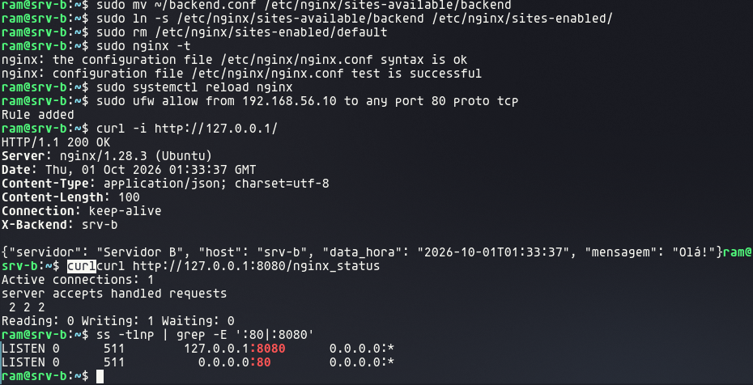

### 5.3 Testar dentro de cada VM

📦 **VM `srv-a`** e 📦 **VM `srv-b`**
```bash
curl -i http://127.0.0.1/                   # passa pelo Nginx até a aplicação
curl http://127.0.0.1:8080/nginx_status     # contadores do stub_status
ss -tlnp | grep -E ':80|:8080'
```

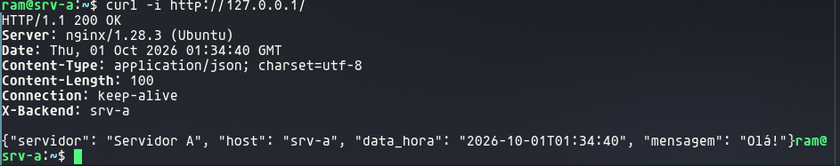

- **`curl -i`**: o `-i` mostra os cabeçalhos. `Server: nginx/1.28.3` e `X-Backend: srv-a` provam que a resposta passou pelo Nginx; o corpo veio da aplicação.
- **`nginx_status`**:
  - `Active connections`: conexões abertas agora.
  - `accepts handled requests`: totais de conexões aceitas, conexões tratadas e requisições.
  - `Reading / Writing / Waiting`: conexões lendo a requisição, escrevendo a resposta e ociosas (keep-alive).
- **`ss`**: `0.0.0.0:80` (site, aberto à rede, filtrado pelo firewall) e `127.0.0.1:8080` (status, só local).

### 5.4 Testar a partir do balanceador

📦 **VM `lb`**
```bash
curl http://192.168.56.11/       # "Servidor A"
curl http://192.168.56.12/       # "Servidor B"
```

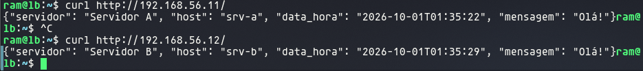

O `lb` alcança o Nginx dos dois servidores pela rede: é exatamente o caminho que o `upstream` vai usar na etapa 6.

### 5.5 Provar que só o lb acessa os backends

🖥️ **PC**
```bash
curl --max-time 3 http://192.168.56.11/    # timeout
```


| Origem | Porta 80 do srv-a | Por quê |
|--------|-------------------|---------|
| 📦 `lb` (192.168.56.10) | ✅ responde | Regra `ufw allow from 192.168.56.10 to any port 80` |
| 🖥️ PC (192.168.56.1) | ❌ timeout | Não está na regra: o firewall descarta |

Assim, todo tráfego para os servidores **obrigatoriamente passa pelo balanceador**, e as métricas do `lb` refletem todas as requisições.

### 5.6 Versionar

🖥️ **PC**
```bash
git add .
git commit -m "feat: Nginx como proxy reverso nos servidores A e B"
git push
```

---

## Etapa 6 — Nginx balanceador no lb

O `lb` é a **porta de entrada** do ambiente: recebe todas as requisições e as distribui entre os Nginx de A e B.

```
PC ──► lb:80 ──upstream (round robin)──┬──► srv-a:80 ──► app A
                                       └──► srv-b:80 ──► app B
```

### O arquivo de configuração

`nginx/lb.conf`:

| Diretiva | Para quê |
|----------|----------|
| `upstream backends { server 192.168.56.11:80; server 192.168.56.12:80; }` | Grupo de destinos: os **Nginx** de A e B (porta 80), nunca a aplicação (5000) |
| *(sem algoritmo declarado)* | **Round robin**: alterna um a um, o padrão do Nginx |
| `max_fails=1 fail_timeout=10s` | Após 1 falha, o servidor fica 10 s fora da rotação |
| `proxy_pass http://backends;` | Envia para o grupo, não para um IP fixo |
| `proxy_set_header ...` | Preserva Host, IP do cliente e protocolo, como nos backends |
| `proxy_connect_timeout 2s;` | Backend fora do ar: desiste em 2 s (o padrão seria 60 s) |
| `proxy_next_upstream error timeout http_502 http_503 http_504;` | Se um backend falhar, a mesma requisição é tentada no outro |
| `add_header X-Upstream $upstream_addr always;` | Mostra na resposta para qual backend a requisição foi |
| `listen 127.0.0.1:8080` + `stub_status` | Status local para o exporter do `lb` |

As três últimas preparam o **cenário 3** (falha de um backend): o cliente não deve ver erro quando A ou B cair.

### 6.1 Enviar o arquivo

🖥️ **PC**
```bash
mv ~/Downloads/lb.conf nginx/
scp nginx/lb.conf ram@192.168.56.10:~/
```

### 6.2 Instalar e ativar

📦 **VM `lb`**
```bash
sudo apt install -y nginx
sudo mv ~/lb.conf /etc/nginx/sites-available/lb
sudo ln -s /etc/nginx/sites-available/lb /etc/nginx/sites-enabled/
sudo rm /etc/nginx/sites-enabled/default
sudo nginx -t
sudo systemctl reload nginx
sudo ufw allow from 192.168.56.1 to any port 80 proto tcp    # porta 80 do lb só para o PC
```

### 6.3 Testar dentro do lb

📦 **VM `lb`**
```bash
curl http://127.0.0.1:8080/nginx_status
ss -tlnp | grep -E ':80|:8080'
```

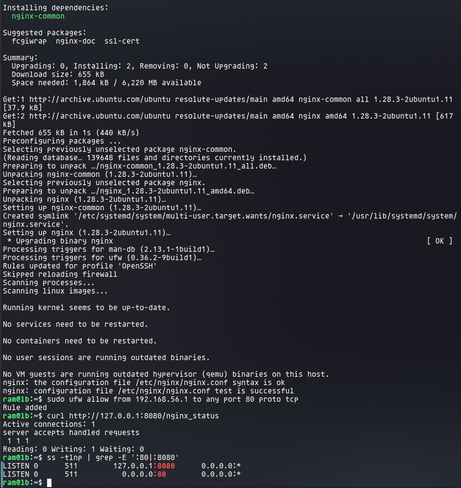

`nginx -t` sem erros, regra do firewall adicionada, `stub_status` respondendo e as portas `0.0.0.0:80` (entrada) e `127.0.0.1:8080` (status) escutando.

### 6.4 Demonstrar o round robin

🖥️ **PC**
```bash
for i in $(seq 6); do curl -s http://192.168.56.10/ | grep -o '"servidor": "[^"]*"'; done
```
Saída esperada: uma resposta por linha, alternando.

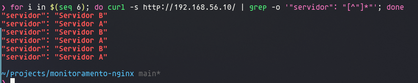

A sequência pode começar por A **ou** por B: o Nginx guarda a posição da rotação entre requisições, então a primeira desta rodada continua de onde a anterior parou. O que importa é a **alternância**.

```bash
curl -i http://192.168.56.10/       # cabeçalhos: X-Upstream e X-Backend
```

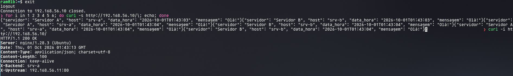

- As 6 requisições alternaram **A, B, A, B, A, B**: o round robin funcionando.
- `X-Upstream: 192.168.56.11:80` (colocado pelo `lb`) e `X-Backend: srv-a` (colocado pelo Nginx do `srv-a`) confirmam o caminho completo: **PC → lb → srv-a**.

### 6.5 Versionar

🖥️ **PC**
```bash
git add .
git commit -m "feat: Nginx balanceador com upstream round robin"
git push
```

---

## Etapa 7 — Exporters nas três VMs

O Prometheus não entra nas VMs: ele **pergunta** periodicamente a cada exporter, por HTTP, e o exporter responde com as métricas em texto. São dois exporters por VM, totalizando os **6 alvos** que o Prometheus vai coletar.

```
                      ┌─ :9100  Node Exporter  ──► CPU, memória, disco, carga, rede
PC (Prometheus) ──────┤
                      └─ :9113  Nginx Exporter ──► lê 127.0.0.1:8080/nginx_status
                                                   e converte em métricas nginx_*
```

| Exporter | Porta | Lê de | Métricas usadas no projeto |
|----------|-------|-------|----------------------------|
| Node Exporter | 9100 | O próprio Linux (`/proc`, `/sys`) | `node_cpu_seconds_total`, `node_memory_*`, `node_network_*`, `node_filesystem_*`, `node_load1` |
| Nginx Prometheus Exporter | 9113 | `stub_status` do Nginx local | `nginx_up`, `nginx_http_requests_total`, `nginx_connections_*` |

**Por que o Nginx Exporter existe:** o `stub_status` mostra um texto simples, que o Prometheus não entende. O exporter lê esse texto e o converte para o formato do Prometheus.

### A configuração

Os dois exporters vêm como **pacotes do Ubuntu** e já sobem como serviço systemd. O Node Exporter funciona sem configuração. O Nginx Exporter precisa saber onde está o status, porque o padrão do pacote é `/stub_status` e o nosso endpoint é `/nginx_status`:

`exporters/prometheus-nginx-exporter` → `/etc/default/prometheus-nginx-exporter`
```bash
ARGS="--nginx.scrape-uri=http://127.0.0.1:8080/nginx_status --web.listen-address=:9113"
```
| Opção | Para quê |
|-------|----------|
| `--nginx.scrape-uri` | Endereço do `stub_status` local que o exporter lê |
| `--web.listen-address=:9113` | Porta em que o exporter publica as métricas |

O arquivo `/etc/default/<serviço>` é onde o Ubuntu guarda os parâmetros dos serviços instalados por pacote: o systemd lê a variável `ARGS` e a passa ao programa.

### 7.1 Enviar o arquivo para as três VMs

🖥️ **PC**
```bash
mkdir -p exporters
mv ~/Downloads/prometheus-nginx-exporter exporters/
for ip in 10 11 12; do scp exporters/prometheus-nginx-exporter ram@192.168.56.$ip:~/; done
```

### 7.2 Instalar

📦 **VM `lb`**, 📦 **VM `srv-a`** e 📦 **VM `srv-b`** (comandos idênticos nas três)
```bash
sudo apt install -y prometheus-node-exporter prometheus-nginx-exporter
sudo mv ~/prometheus-nginx-exporter /etc/default/prometheus-nginx-exporter
sudo systemctl restart prometheus-nginx-exporter                     # relê o ARGS novo
sudo ufw allow from 192.168.56.1 to any port 9100,9113 proto tcp     # exporters só para o PC
```

### 7.3 Testar dentro de cada VM

📦 **VM `lb`**, 📦 **VM `srv-a`** e 📦 **VM `srv-b`**
```bash
curl -s http://127.0.0.1:9100/metrics | grep "^node_load1"   # Node Exporter
curl -s http://127.0.0.1:9113/metrics | grep "^nginx_up"     # Nginx Exporter
ss -tlnp | grep -E ':9100|:9113'
```

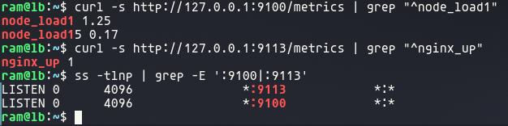
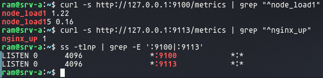
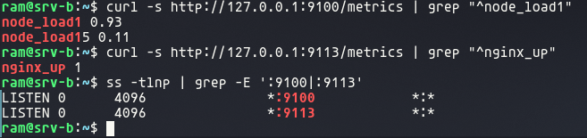

| Saída | Significado |
|-------|-------------|
| `node_load1 1.25` / `node_load15 0.17` | Carga média do último 1 min e dos últimos 15 min (alta logo após a instalação, que acabou de rodar) |
| `nginx_up 1` | O exporter conseguiu ler o `stub_status`. **0** = não conseguiu (caminho ou porta errados, ou Nginx parado) |
| `*:9100` e `*:9113` | Exporters escutando em todas as interfaces; o firewall limita quem acessa |

O `grep "^node_load1"` também mostra `node_load15`, porque começa com o mesmo texto.

### 7.4 Testar do PC (como o Prometheus vai coletar)

🖥️ **PC**
```bash
for ip in 10 11 12; do
  echo "== 192.168.56.$ip"
  curl -s --max-time 3 http://192.168.56.$ip:9100/metrics | grep "^node_load1"
  curl -s --max-time 3 http://192.168.56.$ip:9113/metrics | grep "^nginx_up"
done
```

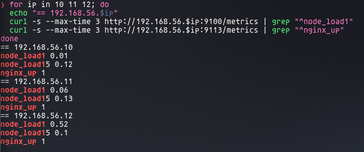

As três VMs responderam nas duas portas: são os **6 alvos** (3 Node Exporter + 3 Nginx Exporter), todos com `nginx_up 1`.

### 7.5 Provar que só o PC acessa os exporters

📦 **VM `lb`** (uma VM qualquer tentando ler o exporter de outra)
```bash
curl --max-time 3 http://192.168.56.11:9100/metrics
```

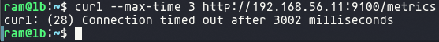

| Origem | Porta 9100/9113 das VMs | Por quê |
|--------|-------------------------|---------|
| 🖥️ PC (192.168.56.1) | ✅ responde | Regra `ufw allow from 192.168.56.1 to any port 9100,9113` |
| 📦 `lb` (192.168.56.10) | ❌ timeout | Não está na regra: o firewall descarta |

Atende ao enunciado: *"Restringir o acesso às portas dos exporters ao computador que executa o Prometheus."*

### 7.6 Versionar

🖥️ **PC**
```bash
git add .
git commit -m "feat: Node Exporter e Nginx Exporter nas três VMs"
git push
```

---

## Etapa 8 — Prometheus no PC

O Prometheus roda no **PC**, em Docker, e coleta a cada 5 s as métricas dos 6 exporters das VMs. O mesmo `docker-compose.yml` já sobe o Grafana, usado na etapa 9.

```
PC ─ Docker ─┬─ Prometheus (localhost:9090) ──coleta a cada 5 s──► 6 exporters nas VMs
             └─ Grafana    (localhost:3000) ──consulta──► Prometheus
```

### Por que Docker

- Nada instalado direto no PC: sobe e remove com um comando.
- A configuração fica toda no repositório (`docker-compose.yml` + `prometheus.yml`): qualquer integrante do grupo reproduz o ambiente igual.
- O enunciado permite: *"inclusive por contêiner se desejado"*.

### O `docker-compose.yml`

| Trecho | Para quê |
|--------|----------|
| `image: prom/prometheus` / `grafana/grafana-oss` | Imagens oficiais, edições gratuitas e open source |
| `network_mode: host` | Containers usam a rede do PC: saem para as VMs com o IP `192.168.56.1`, o mesmo liberado no firewall dos exporters |
| `./prometheus/prometheus.yml:/etc/prometheus/prometheus.yml:ro` | Usa a config do repositório, somente leitura (`ro`) |
| `prometheus-data` / `grafana-data` | Volumes: métricas e dashboards sobrevivem a reinícios |
| `--storage.tsdb.retention.time=15d` | Guarda 15 dias de histórico |
| `--web.enable-lifecycle` | Permite recarregar a config sem reiniciar o container |
| `restart: unless-stopped` | Sobe de novo sozinho após reiniciar o PC |

### O `prometheus.yml`

```yaml
global:
  scrape_interval: 5s
scrape_configs:
  - job_name: node                      # 3 alvos na porta 9100
    static_configs:
      - targets: ['192.168.56.10:9100']
        labels: { vm: lb, papel: balanceador }
      # ... srv-a (.11) e srv-b (.12)
  - job_name: nginx                     # 3 alvos na porta 9113
    # ... mesmos rótulos
```

| Item | Para quê |
|------|----------|
| `scrape_interval: 5s` | Coleta curta: os testes de carga aparecem quase em tempo real (o padrão é 1 min) |
| `job_name: node` / `nginx` | Separa os alvos por tipo de exporter; vira o rótulo `job` |
| `targets` | IP:porta de cada exporter |
| `labels: vm, papel` | Rótulos próprios que distinguem **balanceador, servidor A e servidor B**, como pede o enunciado. Nos dashboards, filtra-se por `vm="srv-a"` em vez de decorar IPs |

### 8.1 Subir os containers

🖥️ **PC** (na pasta do repositório)
```bash
mkdir -p prometheus
mv ~/Downloads/docker-compose.yml .
mv ~/Downloads/prometheus.yml prometheus/
docker compose up -d       # baixa as imagens e sobe em segundo plano
docker compose ps          # os dois containers "Up"
```

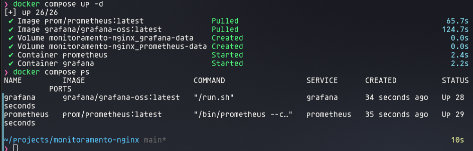

A coluna `PORTS` fica vazia por causa do `network_mode: host`: os containers não mapeiam portas, usam as do próprio PC.

### 8.2 Conferir os 6 alvos

🖥️ **PC** → navegador: **http://localhost:9090/targets** (*Status → Target health*)

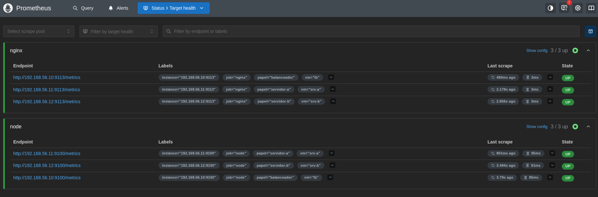

- **nginx 3/3 up** e **node 3/3 up**: os 6 alvos coletando.
- Cada alvo com `instance`, `job`, `papel` e `vm`.
- *Last scrape* de poucos segundos atrás confirma a coleta a cada 5 s.

### 8.3 Consulta `up`

🖥️ **PC** → navegador: **http://localhost:9090/query** → digitar `up` → *Execute*

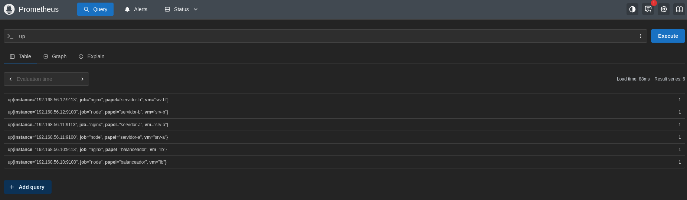

`up` é uma métrica que o **próprio Prometheus** cria para cada alvo: **1** = a última coleta funcionou, **0** = falhou. As **6 séries com valor 1** comprovam todos os alvos UP.

Pelo terminal:
```bash
curl -s localhost:9090/api/v1/targets | grep -o '"health":"[a-z]*"' | sort | uniq -c   # 6 "health":"up"
```

### 8.4 Versionar

🖥️ **PC**
```bash
git add .
git commit -m "feat: Prometheus com os 6 alvos via Docker Compose"
git push
```

---

## Etapa 9 — Grafana e dashboards

O Grafana (já subido pelo `docker-compose.yml`) consulta o Prometheus e mostra as métricas em **dois dashboards separados**, como exige o enunciado:

| Dashboard | Fonte | Painéis |
|-----------|-------|---------|
| **Infraestrutura das VMs** | Node Exporter | Estado dos 6 alvos, CPU, memória, rede, carga (`node_load1`), disco |
| **Nginx e tráfego HTTP** | Nginx Exporter | `nginx_up`, taxa de requisições, A × B, distribuição, conexões ativas, aceitas × processadas, leitura/escrita/espera |

### Provisionamento: tudo como código

Em vez de configurar o Grafana clicando, a fonte de dados e os dashboards ficam em arquivos no repositório e são **carregados automaticamente** quando o container sobe:

| Arquivo | Para quê |
|---------|----------|
| `grafana/provisioning/datasources/prometheus.yml` | Cadastra o Prometheus (`http://localhost:9090`) como fonte de dados padrão |
| `grafana/provisioning/dashboards/dashboards.yml` | Manda o Grafana ler os JSON da pasta `grafana/dashboards/` |
| `grafana/dashboards/*.json` | Os dois dashboards. São também a **exportação em JSON** pedida na entrega |

No `docker-compose.yml`, o serviço `grafana` monta essas pastas:
```yaml
volumes:
  - ./grafana/provisioning:/etc/grafana/provisioning:ro
  - ./grafana/dashboards:/var/lib/grafana/dashboards:ro
```

**Vantagem:** qualquer integrante sobe o Grafana já configurado, com um comando. Se os dashboards forem editados pela interface, exportar de novo em *Share → Export → Save to file* e substituir o JSON na pasta.

### 9.1 Subir e acessar

🖥️ **PC** (na pasta do repositório)
```bash
docker compose up -d
```
🖥️ **PC** → navegador: **http://localhost:3000** → usuário `admin`, senha `admin` (pede para trocar no primeiro acesso) → *Dashboards → Monitoramento Nginx*

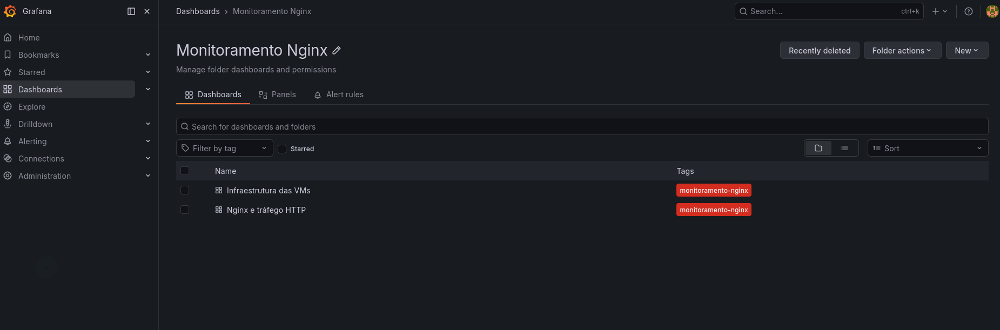

### 9.2 Dashboard de infraestrutura

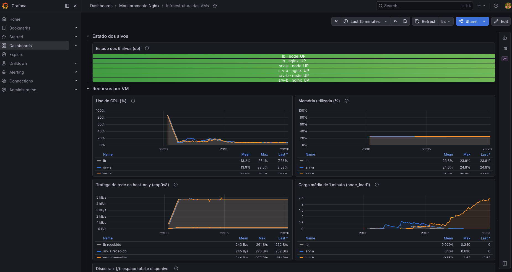
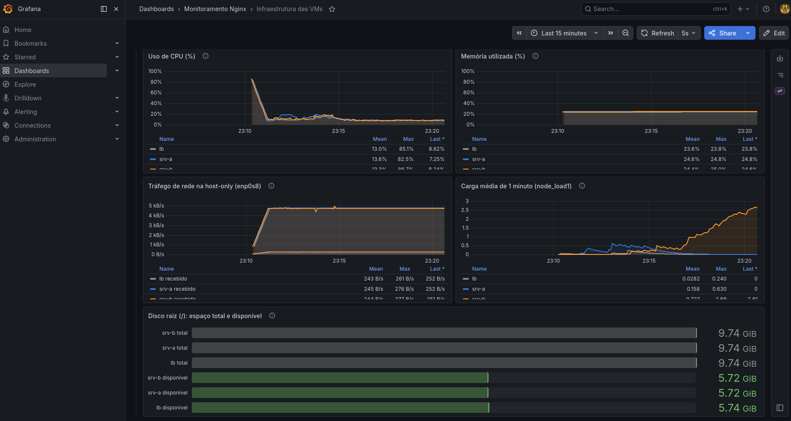

| Painel | Consulta PromQL | Unidade |
|--------|-----------------|---------|
| Estado dos 6 alvos | `up` | UP/DOWN |
| Uso de CPU | `100 * (1 - avg by (vm) (rate(node_cpu_seconds_total{mode="idle"}[1m])))` | % |
| Memória utilizada | `100 * (1 - node_memory_MemAvailable_bytes / node_memory_MemTotal_bytes)` | % |
| Tráfego de rede | `rate(node_network_receive_bytes_total{device="enp0s8"}[1m])` e `..._transmit_...` | B/s |
| Carga média | `node_load1` | — |
| Disco raiz | `node_filesystem_size_bytes{mountpoint="/"}` e `node_filesystem_avail_bytes{mountpoint="/"}` | bytes |

### 9.3 Dashboard de Nginx e tráfego HTTP

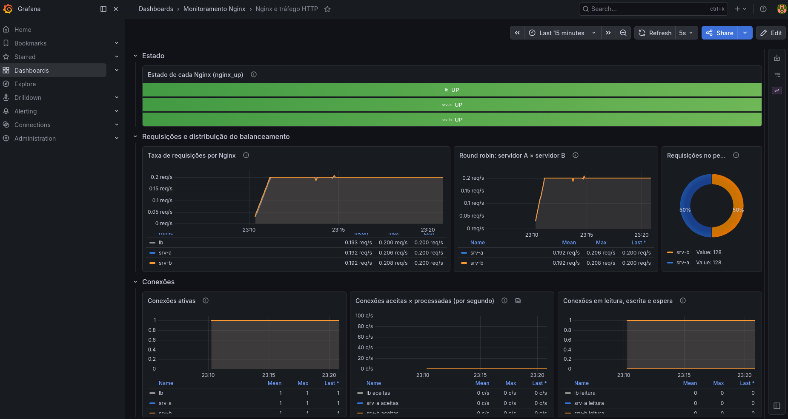

| Painel | Consulta PromQL | Unidade |
|--------|-----------------|---------|
| Estado de cada Nginx | `nginx_up` | UP/DOWN |
| Taxa de requisições | `rate(nginx_http_requests_total[1m])` | req/s |
| Round robin A × B (mesmo painel) | `rate(nginx_http_requests_total{vm=~"srv-a\|srv-b"}[1m])` | req/s |
| Distribuição no período | `round(sum by (vm) (increase(nginx_http_requests_total{vm=~"srv-a\|srv-b"}[$__range])))` | requisições |
| Conexões ativas | `nginx_connections_active` | — |
| Aceitas × processadas | `rate(nginx_connections_accepted[1m])` e `rate(nginx_connections_handled[1m])` | conexões/s |
| Leitura / escrita / espera | `nginx_connections_reading`, `..._writing`, `..._waiting` | — |

### Padrões adotados em todos os painéis

- **Título, unidade, legenda e intervalo:** cada painel tem título descritivo, unidade (%, B/s, req/s...) e legenda em tabela com média, máximo e último valor. Intervalo padrão: últimos 15 min, atualização a cada 5 s.
- **Contadores com `rate`:** métricas que só crescem (`*_total`, `accepted`, `handled`) são transformadas em taxa por segundo; métricas instantâneas (`node_load1`, `nginx_connections_active`) são usadas direto.
- **Cores fixas por VM:** `lb` cinza, `srv-a` azul, `srv-b` laranja, em todos os painéis.
- **Descrição em cada painel** (ícone ⓘ ao lado do título) explicando a consulta.

### 9.4 Linha de base (sem tráfego)

Mesmo sem ninguém acessando, os gráficos não ficam zerados:

| O que aparece | Por quê |
|---------------|---------|
| **0,2 req/s** em cada Nginx | O próprio monitoramento: o exporter lê o `stub_status` a cada 5 s, e cada leitura é uma requisição (1 ÷ 5 s = 0,2 req/s) |
| ~4,8 kB/s transmitidos por VM | Os exporters respondendo às coletas do Prometheus |
| CPU ~10%, memória ~24% | Consumo do sistema, do Nginx, da aplicação e dos exporters parados |

Essa é a **linha de base** contra a qual os experimentos são comparados.

### 9.5 Com tráfego

🖥️ **PC**
```bash
for i in $(seq 200); do curl -s http://192.168.56.10/ > /dev/null; done
```

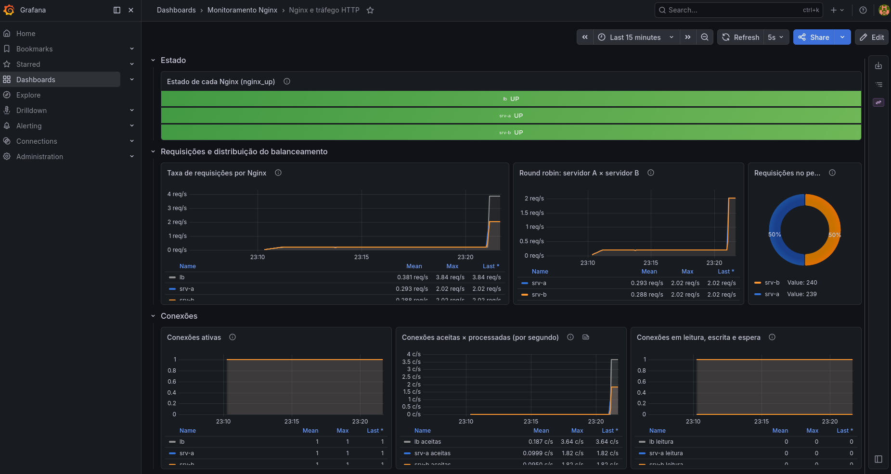
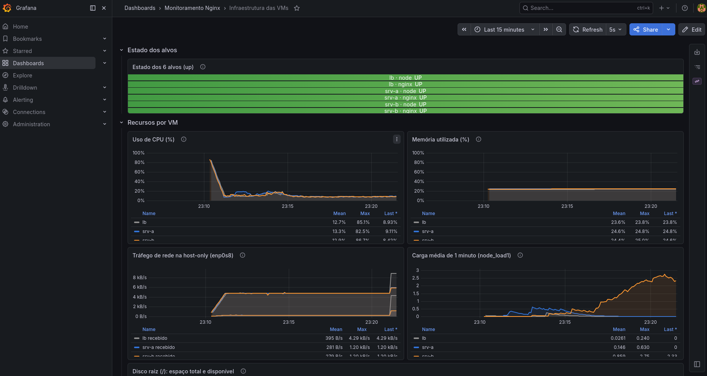

| Nginx | Taxa | Leitura |
|-------|------|---------|
| `lb`    | 3,84 req/s | Todo o tráfego entra por ele (≈3,64) + 0,2 do exporter |
| `srv-a` | 2,02 req/s | Metade (≈1,82) + 0,2 do exporter |
| `srv-b` | 2,02 req/s | A outra metade (≈1,82) + 0,2 do exporter |

- **Distribuição: 239 × 240 requisições (50% / 50%).** Round robin praticamente perfeito.
- **Conexões aceitas:** `lb` 3,64 c/s; A e B 1,82 c/s cada. Cada `curl` abre uma conexão nova, e o `lb` abre uma nova conexão com o backend a cada requisição; por isso a taxa de conexões acompanha a de requisições.
- **Rede:** o `lb` recebe ~4,3 kB/s e cada backend ~1,2 kB/s; o tráfego se divide depois do balanceador.

### 9.6 Três consultas PromQL explicadas

O enunciado pede que o grupo saiba explicar a consulta de pelo menos três painéis.

**1. Uso de CPU (%)**
```promql
100 * (1 - avg by (vm) (rate(node_cpu_seconds_total{mode="idle"}[1m])))
```
- `node_cpu_seconds_total{mode="idle"}`: contador de segundos que cada núcleo passou **ocioso** desde o boot.
- `rate(...[1m])`: quantos segundos ocioso **por segundo**, no último minuto. Dá um valor entre 0 e 1 (0,9 = 90% do tempo parado).
- `avg by (vm)`: média dos núcleos de cada VM (aqui, 1 núcleo por VM), mantendo uma linha por VM.
- `1 - ...`: inverte de ocioso para **ocupado**. `100 *`: em porcentagem.

**2. Taxa de requisições por Nginx**
```promql
rate(nginx_http_requests_total[1m])
```
- `nginx_http_requests_total`: contador de requisições desde que o Nginx ligou; só cresce, então o valor bruto não diz nada sobre "agora".
- `rate(...[1m])`: diferença do contador no último minuto dividida pelo tempo = **requisições por segundo**.
- No painel A × B, o filtro `{vm=~"srv-a|srv-b"}` (`=~` = expressão regular) deixa só os backends, para comparar o round robin.

**3. Memória utilizada (%)**
```promql
100 * (1 - node_memory_MemAvailable_bytes / node_memory_MemTotal_bytes)
```
- `MemAvailable`: memória que ainda pode ser usada sem recorrer a swap (inclui cache que pode ser liberado). `MemTotal`: memória total.
- `disponível / total`: fração livre. `1 - ...`: fração usada. `100 *`: porcentagem.
- São *gauges* (valores instantâneos), por isso não precisam de `rate`.

### 9.7 Versionar

🖥️ **PC**
```bash
git add .
git commit -m "feat: Grafana com dashboards provisionados"
git push
```

---

## Roteiro de demonstração ao professor

Ordem sugerida, com tudo ligado. Cada linha diz **onde** rodar e **o que dizer**.

### A. Infraestrutura

| # | Onde rodar | Comando | Mostrar / explicar |
|---|------------|---------|--------------------|
| 1 | 🧰 VirtualBox | *Settings → Network* de uma VM | Duas placas: NAT (internet) e host-only (rede do projeto) |
| 2 | 🖥️ PC | `ip -4 addr` | O PC tem `192.168.56.1` na placa host-only: é por ela que o Prometheus vai coletar |
| 3 | 🖥️ PC | `ping -c 2 192.168.56.10` (e `.11`, `.12`) | O PC alcança as três VMs |
| 4 | 📦 VM `srv-a` | `ping -c 2 192.168.56.10` e `.12` | As VMs se comunicam entre si; `ttl=64` = mesma rede |
| 5 | 📦 qualquer VM | `hostnamectl` | Hostname e versão do sistema |
| 6 | 📦 qualquer VM | `ip -4 addr show enp0s8` | IP fixo (`valid_lft forever`) |
| 7 | 📦 qualquer VM | `sudo ufw status verbose` | Entrada bloqueada por padrão; só o necessário liberado |

### B. Aplicação

| # | Onde rodar | Comando | Mostrar / explicar |
|---|------------|---------|--------------------|
| 8  | 📦 VM `srv-a` | `curl http://127.0.0.1:5000/` | Responde "Servidor A" com data e hora |
| 9  | 📦 VM `srv-b` | `curl http://127.0.0.1:5000/` | Responde "Servidor B" (mesmo código, outra variável) |
| 10 | 📦 VM `srv-a` | `curl http://127.0.0.1:5000/health` | Rota de saúde |
| 11 | 📦 VM `srv-a` | `curl "http://127.0.0.1:5000/carga?n=1000000"` | Tempo maior que no `/`: a rota gera carga de CPU controlada |
| 12 | 📦 VM `srv-a` | `ss -tlnp \| grep 5000` | Escuta só em `127.0.0.1` |
| 13 | 🖥️ **PC** | `curl --max-time 3 http://192.168.56.11:5000/` | **Falha** (timeout): a porta interna não é acessível pela rede |
| 14 | 📦 VM `srv-a` | `systemctl status app --no-pager` | Roda como serviço: sobe no boot, religa se cair |

### C. Nginx nos servidores

| # | Onde rodar | Comando | Mostrar / explicar |
|---|------------|---------|--------------------|
| 15 | 📦 VM `srv-a` | `cat /etc/nginx/sites-available/backend` | `proxy_pass` para `127.0.0.1:5000`, cabeçalhos preservados, `stub_status` em `127.0.0.1:8080` |
| 16 | 📦 VM `srv-a` | `curl -i http://127.0.0.1/` | `Server: nginx` e `X-Backend: srv-a`: passou pelo Nginx até a aplicação |
| 17 | 📦 VM `srv-a` | `curl http://127.0.0.1:8080/nginx_status` | Contadores que o exporter vai ler |
| 18 | 📦 VM `lb` | `curl http://192.168.56.11/` e `.12/` | O balanceador alcança os dois backends |
| 19 | 🖥️ **PC** | `curl --max-time 3 http://192.168.56.11/` | **Timeout**: só o `lb` pode acessar os backends |
| 20 | 📦 VM `srv-a` | `sudo ufw status` | Regra da porta 80 restrita a `192.168.56.10` |

### D. Balanceamento

| # | Onde rodar | Comando | Mostrar / explicar |
|---|------------|---------|--------------------|
| 21 | 📦 VM `lb` | `cat /etc/nginx/sites-available/lb` | `upstream` apontando para a porta **80** dos Nginx de A e B (não para a 5000); sem algoritmo = round robin |
| 22 | 🖥️ **PC** | `for i in $(seq 6); do curl -s http://192.168.56.10/ \| grep -o '"servidor": "[^"]*"'; done` | Respostas alternando A, B, A, B... |
| 23 | 🖥️ **PC** | `curl -i http://192.168.56.10/` | `X-Upstream` (escolha do lb) e `X-Backend` (quem respondeu) |
| 24 | 📦 VM `lb` | `curl http://127.0.0.1:8080/nginx_status` | Status do balanceador; os contadores sobem a cada requisição |

### E. Exporters

| # | Onde rodar | Comando | Mostrar / explicar |
|---|------------|---------|--------------------|
| 25 | 📦 VM `srv-a` | `cat /etc/default/prometheus-nginx-exporter` | O exporter lê o `stub_status` local em `127.0.0.1:8080/nginx_status` |
| 26 | 📦 VM `srv-a` | `curl -s http://127.0.0.1:9113/metrics \| grep "^nginx_"` | O texto do `stub_status` convertido em métricas `nginx_*` |
| 27 | 🖥️ **PC** | o `for` da etapa 7.4 | Os 6 alvos respondendo |
| 28 | 📦 VM `lb` | `curl --max-time 3 http://192.168.56.11:9100/metrics` | **Timeout**: só o PC acessa os exporters |
| 29 | 📦 qualquer VM | `sudo ufw status` | Portas 9100 e 9113 liberadas só para `192.168.56.1` |

### F. Prometheus

| # | Onde rodar | Comando / ação | Mostrar / explicar |
|---|------------|----------------|--------------------|
| 30 | 🖥️ PC | `docker compose ps` | Prometheus e Grafana rodando em containers |
| 31 | 🖥️ PC | `cat prometheus/prometheus.yml` | 2 jobs × 3 alvos, rótulos `vm` e `papel`, coleta a cada 5 s |
| 32 | 🖥️ PC (navegador) | `localhost:9090/targets` | **6 alvos UP** |
| 33 | 🖥️ PC (navegador) | consulta `up` | 6 séries com valor 1 |
| 34 | 🖥️ PC (navegador) | consulta `up{vm="srv-a"}` | Os rótulos filtram uma VM específica |

### G. Grafana

| # | Onde rodar | Ação | Mostrar / explicar |
|---|------------|------|--------------------|
| 35 | 🖥️ PC | `ls grafana/provisioning grafana/dashboards` | Fonte de dados e dashboards como código, carregados automaticamente |
| 36 | 🖥️ PC (navegador) | Dashboard *Infraestrutura das VMs* | Seção de infraestrutura: alvos, CPU, memória, rede, carga, disco |
| 37 | 🖥️ PC (navegador) | Dashboard *Nginx e tráfego HTTP* | Seção HTTP: requisições, A × B, conexões |
| 38 | 🖥️ PC | `for i in $(seq 200); do curl -s http://192.168.56.10/ > /dev/null; done` | Ao vivo: a taxa sobe e A e B ficam sobrepostos; a pizza fica em 50/50 |
| 39 | 🖥️ PC (navegador) | Ícone ⓘ / *Edit* nos painéis de CPU, requisições e memória | Explicar as 3 consultas PromQL (seção 9.6) |
| 40 | 🖥️ PC (navegador) | Painel de requisições sem tráfego | Linha de base de 0,2 req/s = o próprio exporter |

### H. Repositório

| # | Onde | O que mostrar |
|---|------|---------------|
| 41 | GitHub | Histórico de commits (uma etapa por commit) e as pastas `lb/`, `srv-a/`, `srv-b/`, `app/`, `nginx/`, `exporters/`, `prometheus/`, `grafana/` e o `docker-compose.yml` |

---

## Decisões técnicas (perguntas prováveis)

**Por que NAT + host-only, e não bridge?**
A host-only é uma rede só entre o PC e as VMs, com IPs que não dependem do roteador de casa ou da faculdade: o ambiente funciona igual em qualquer lugar. As VMs também não ficam expostas na rede local. A NAT serve apenas para a VM acessar a internet.

**Por que IP fixo?**
Os IPs vão no `upstream` do Nginx e no `prometheus.yml`. Se mudassem (DHCP), essas configurações quebrariam. Ficam fora da faixa DHCP para não haver conflito.

**Por que a host-only não tem gateway no netplan?**
Uma máquina deve ter uma única rota padrão. Ela já vem pela NAT (DHCP), que é a única com saída para a internet.

**Por que 1 vCPU e pouca memória?**
Suficiente para Nginx, aplicação e exporters. Com 1 vCPU, a rota de carga satura a CPU rapidamente e o efeito fica visível nos gráficos. `srv-a` e `srv-b` são idênticas para a comparação do balanceamento ser justa.

**Por que Ubuntu Server sem interface gráfica?**
Consome menos CPU e RAM, e as métricas refletem só os serviços do projeto.

**Por que clonar e o que foi trocado?**
Para não repetir a instalação. Foram trocados MAC (conflito de rede), hostname, machine-id (identificador único da instalação), chaves SSH (identidade do servidor) e IP.

**Por que a aplicação em Python sem framework?**
Já vem no Ubuntu, sem dependências. Atende a todas as rotas pedidas com um arquivo só.

**Por que systemd?**
A aplicação sobe sozinha no boot, religa se cair e roda com um usuário sem privilégios (`www-data`).

**Por que um Nginx em cada servidor, e não o lb direto na aplicação?**
O enunciado exige. Além disso, a aplicação fica isolada no loopback, e o Nginx de cada servidor fornece o `stub_status` para medir o tráfego de A e de B separadamente, o que permite comparar a distribuição do round robin.

**Por que o stub_status em 127.0.0.1:8080, separado do site?**
Só o exporter da própria VM precisa lê-lo. Numa porta separada e no loopback, ele fica invisível para a rede e não se mistura com o tráfego da aplicação.

**Por que a porta 80 dos servidores só aceita o lb?**
Para que todo o tráfego passe pelo balanceador. Se o PC pudesse acessar A e B direto, haveria requisições fora do balanceamento e as métricas ficariam distorcidas.

**Por que o upstream aponta para a porta 80 e não para a 5000?**
O enunciado exige que o balanceador fale com os Nginx dos servidores, não com a aplicação. E a 5000 só escuta em `127.0.0.1`, então nem seria alcançável pela rede.

**Como funciona o round robin?**
O Nginx percorre a lista do `upstream` em ordem: a 1ª requisição vai para A, a 2ª para B, a 3ª para A... É o padrão quando nenhum algoritmo é declarado. Funciona bem quando os servidores são iguais, como aqui.

**O que acontece se um backend cair?**
Com `proxy_connect_timeout 2s` e `proxy_next_upstream`, o `lb` desiste do servidor em até 2 s e reenvia a requisição para o outro; com `max_fails=1 fail_timeout=10s`, o servidor que falhou fica 10 s fora da rotação. (Será demonstrado no cenário 3.)

**Por que a porta 80 do lb só aceita o PC?**
O PC é o único cliente: é dele que saem os testes e o gerador de carga. Liberar só o necessário é o princípio do firewall do projeto.

**Por que dois exporters por VM?**
Cada um mede uma coisa: o Node Exporter mede a máquina (CPU, memória, disco, rede); o Nginx Exporter mede o tráfego HTTP (requisições e conexões). Juntos, mostram o efeito da carga na infraestrutura e no serviço.

**Por que o Nginx Exporter, se já existe o stub_status?**
O `stub_status` é um texto simples que o Prometheus não sabe ler. O exporter o lê localmente e o converte para o formato de métricas do Prometheus.

**Por que o stub_status fica local, mas os exporters ficam abertos à rede?**
O `stub_status` só é lido pelo exporter da própria VM, então não precisa sair dela. Já os exporters precisam ser lidos pelo Prometheus, que roda no PC; por isso escutam na rede, com o firewall liberando apenas o IP do PC.

**Por que instalar pelos pacotes do Ubuntu?**
Já vêm com o serviço systemd configurado (sobe no boot, religa se cair) e são atualizados pelo `apt`. São as versões open source exigidas.

**Por que o Prometheus no PC e em Docker?**
O enunciado permite rodar no computador local, inclusive em contêiner. Com Docker, nada é instalado no PC e toda a configuração fica versionada; qualquer integrante sobe o mesmo ambiente com `docker compose up -d`.

**Por que `network_mode: host`?**
Os containers usam a rede do PC diretamente, então o Prometheus chega às VMs pela host-only com o IP `192.168.56.1`, exatamente o liberado no firewall dos exporters. Sem isso, o tráfego passaria por uma rede interna do Docker.

**Para que servem os rótulos `vm` e `papel`?**
O enunciado pede rótulos que distingam balanceador, servidor A e servidor B. Com eles, as consultas e os dashboards filtram por nome (`vm="srv-a"`) em vez de IP, e a legenda dos gráficos fica legível.

**Por que coletar a cada 5 s?**
O padrão (1 min) é lento para testes de carga de poucos minutos. Com 5 s, as mudanças aparecem quase em tempo real, e o `rate(...[1m])` tem 12 amostras por janela.

**O que é a métrica `up`?**
É criada pelo próprio Prometheus para cada alvo: 1 se a última coleta funcionou, 0 se falhou. É a base do painel de estado dos alvos.

**Por que provisionar o Grafana por arquivos, e não pela interface?**
Reprodutibilidade: a fonte de dados e os dashboards ficam no repositório e são carregados ao subir o container. Os próprios arquivos JSON são a exportação exigida na entrega.

**Por que usar `rate` em alguns painéis e não em outros?**
Contadores (`*_total`, `accepted`, `handled`) só crescem desde que o serviço ligou; o valor bruto não mostra o que acontece agora. `rate` calcula a variação por segundo. Gauges (`node_load1`, `nginx_connections_active`, memória) já são o valor do momento e são usados direto.

**Por que aparecem 0,2 req/s sem ninguém acessando?**
É o próprio monitoramento: o exporter lê o `stub_status` a cada 5 s, e cada leitura conta como uma requisição no Nginx (1 ÷ 5 = 0,2 req/s).

**Por que o painel de rede filtra `device="enp0s8"`?**
É a placa host-only, por onde passa todo o tráfego do projeto (balanceamento e coleta). A placa NAT só carrega atualizações do sistema e o loopback é interno.

**Como vocês provam que a porta 5000 não é acessível?**
`ss` mostra que ela escuta só em `127.0.0.1`, e o `curl` de fora (PC ou outra VM) falha por timeout, porque o firewall descarta o pacote.

---

## Dificuldades e soluções

| Problema | Causa | Solução |
|----------|-------|---------|
| Instalação falhou (`configure_apt`, "An error occurred") | Três VMs instalando ao mesmo tempo com 1 GB | Instalar uma por vez |
| "Já existe uma VM com esse nome" ao recriar | VM removida com *Remove only*: a pasta ficou no disco | Apagar a pasta em *Preferences → Default Machine Folder* |
| Interfaces confundidas | — | NAT = `10.0.2.x`; host-only = `192.168.56.x` (padrões do VirtualBox) |
| nano abriu vazio / "is a directory" | Caminho sem o nome do arquivo, ou só o nome sem a pasta | Usar o caminho completo; Tab para completar |
| `mv README.md GUIA.md` sobrescreveu um arquivo | Sem destino, o `mv` renomeia | O último argumento é sempre o destino (`.` = pasta atual) |
| REMOTE HOST IDENTIFICATION HAS CHANGED | Chaves SSH regeneradas no clone; PC guardava a antiga | `ssh-keygen -R IP` no PC |
| App instalada no `lb` por engano | Terminal conectado na VM errada | Conferir o hostname no prompt |
| Nome saía só "Servidor" | `Environment=APP_NAME=Servidor A` é cortado no espaço | Aspas: `Environment="APP_NAME=Servidor A"` |
| `curl` sem resposta logo após o `restart` | A aplicação ainda estava subindo | `systemctl status app` e `curl -v` |
| `ufw: ERROR: Wrong number of arguments` | Faltou o número da porta na regra | `sudo ufw allow from 192.168.56.10 to any port 80 proto tcp` |
| `curl: Protocol "htt" not supported` / `Bad hostname` | Erro de digitação (`htt://`, `=i` em vez de `-i`) | Conferir o comando; usar ↑ para editar o anterior |
| `node_load1` do `srv-b` em ~2,5 com CPU ~10% | Atividade passageira após o boot (checagem de atualizações). `top`, `ps` (estado D) e `unattended-upgrades` não mostraram nada preso; a carga caiu sozinha (2,05 → 1,75 → 0,90). `nproc` e `free -m` confirmaram hardware idêntico em A e B | Esperar estabilizar antes dos experimentos |
| Legendas cortadas nos painéis | Painéis baixos demais para a legenda em tabela | Altura maior nos painéis (JSON v2) |
| Respostas do `for` grudadas numa linha só | `\;` antes do `echo`: a barra fez o `;` virar texto | `;` sem barra, ou filtrar com `grep -o` (uma resposta por linha) |

---

## Próximas etapas

- [x] VMs, rede, hostname, SSH e firewall
- [x] Aplicação em A e B (somente loopback)
- [x] Nginx em `srv-a` e `srv-b` como proxy reverso para `127.0.0.1:5000` + `stub_status`
- [x] Nginx balanceador no `lb` (upstream round robin) + `stub_status`
- [x] Node Exporter e Nginx Prometheus Exporter nas três VMs (acesso restrito ao PC)
- [x] Prometheus no PC: 6 alvos UP com rótulos
- [x] Grafana: dashboards de infraestrutura e de Nginx/HTTP
- [ ] Experimentos: carga normal, aumento de carga, falha de backend, estratégia alternativa
