# Monitoramento de Infraestrutura com Nginx, Prometheus e Grafana

Este repositório conta como montamos, do zero, um pequeno ambiente distribuído: um **balanceador Nginx** que reparte as requisições entre **dois servidores de aplicação**, e uma camada de **observabilidade** com Prometheus e Grafana para enxergar o que acontece lá dentro.

A ideia aqui não é só listar comandos. Fomos registrando cada etapa na ordem em que ela aconteceu, explicando **por que** fizemos de cada jeito, o que deu errado no caminho e o que os números mostraram no final. Quem seguir este README do começo ao fim consegue reconstruir o ambiente inteiro.

> 📋 Para a demonstração ao professor, existe um roteiro separado: **[ROTEIRO.md](ROTEIRO.md)**.
> 📚 Para estudar os comandos e conceitos com calma: **[GUIA.md](GUIA.md)**.

## Sumário

1. [Visão geral](#visão-geral)
2. [O ambiente em números](#o-ambiente-em-números)
3. [Antes de começar: como ler este guia](#antes-de-começar-como-ler-este-guia)
4. [Etapa 1 — Criando a primeira VM](#etapa-1--criando-a-primeira-vm)
5. [Etapa 2 — Preparando o balanceador (lb)](#etapa-2--preparando-o-balanceador-lb)
6. [Etapa 3 — Clonando os servidores A e B](#etapa-3--clonando-os-servidores-a-e-b)
7. [Etapa 4 — A aplicação](#etapa-4--a-aplicação)
8. [Etapa 5 — Nginx na frente da aplicação](#etapa-5--nginx-na-frente-da-aplicação)
9. [Etapa 6 — O balanceador](#etapa-6--o-balanceador)
10. [Etapa 7 — Os exporters](#etapa-7--os-exporters)
11. [Etapa 8 — Prometheus](#etapa-8--prometheus)
12. [Etapa 9 — Grafana](#etapa-9--grafana)
13. [Etapa 10 — Os experimentos](#etapa-10--os-experimentos)
14. [O que aprendemos: resultados, limitações e melhorias](#o-que-aprendemos-resultados-limitações-e-melhorias)
15. [Por que fizemos assim](#por-que-fizemos-assim)
16. [Tropeços no caminho](#tropeços-no-caminho)
17. [O que foi entregue](#o-que-foi-entregue)

---

## Visão geral

```
                 ┌──────────────────── PC (host) 192.168.56.1 ────────────────────┐
                 │   Prometheus  ·  Grafana  ·  gerador de carga  ·  SSH / Git    │
                 └───────────────────────────────┬────────────────────────────────┘
                                                 │  rede host-only 192.168.56.0/24
              ┌──────────────────────────────────┼──────────────────────────────────┐
              │                                  │                                  │
     ┌────────┴────────┐               ┌─────────┴────────┐               ┌─────────┴────────┐
     │ VM1  lb         │               │ VM2  srv-a       │               │ VM3  srv-b       │
     │ 192.168.56.10   │──── HTTP ────►│ 192.168.56.11    │               │ 192.168.56.12    │
     │ Nginx balancead.│──── HTTP ─────┼──────────────────┼──────────────►│                  │
     └─────────────────┘               │ Nginx → app      │               │ Nginx → app      │
                                       │ 127.0.0.1:5000   │               │ 127.0.0.1:5000   │
                                       └──────────────────┘               └──────────────────┘
```

O caminho de uma requisição é este: ela sai do PC, chega no **Nginx do `lb`**, que escolhe entre o **Nginx do `srv-a`** e o **Nginx do `srv-b`** (alternando entre eles), e esse Nginx repassa para a **aplicação**, que só escuta dentro da própria máquina, em `127.0.0.1:5000`.

Em paralelo, cada VM tem dois "informantes" (os **exporters**), um sobre a máquina e outro sobre o Nginx. O **Prometheus**, rodando no PC, pergunta a eles a cada 5 segundos como as coisas estão. O **Grafana** transforma essas respostas em gráficos.

---

## O ambiente em números

### As máquinas

| VM  | Nome    | Papel             | IP            | vCPU | RAM        | Disco |
|-----|---------|-------------------|---------------|------|------------|-------|
| VM1 | `lb`    | Nginx balanceador | 192.168.56.10 | 1    | 1642 MiB\* | 10 GB |
| VM2 | `srv-a` | Servidor A        | 192.168.56.11 | 1    | 1642 MiB\* | 10 GB |
| VM3 | `srv-b` | Servidor B        | 192.168.56.12 | 1    | 1642 MiB\* | 10 GB |
| PC  | —       | Prometheus, Grafana e gerador de carga | 192.168.56.1 | — | — | — |

\* É a memória que o sistema enxerga (`free -m`). O valor configurado no VirtualBox é um pouco maior, porque o kernel reserva uma parte. O importante é que **A e B são idênticos**, com o mesmo processador e a mesma memória. Sem isso, a comparação do balanceamento não seria justa.

### A rede de cada VM

Cada máquina tem duas placas de rede, cada uma com uma função:

| Placa    | Tipo      | Endereço             | Para quê |
|----------|-----------|----------------------|----------|
| `enp0s3` | NAT       | 10.0.2.15 (automático) | Sair para a internet e instalar pacotes |
| `enp0s8` | Host-only | 192.168.56.1x (fixo)   | Conversar com as outras VMs e com o PC |

### Quem escuta onde (e quem pode entrar)

| Serviço | Onde | Porta | Quem pode acessar |
|---------|------|-------|-------------------|
| SSH | todas as VMs | 22 | O PC, para administrar |
| Nginx balanceador | lb | 80 | Só o PC |
| Nginx dos servidores | srv-a, srv-b | 80 | Só o `lb` |
| Status do Nginx (`stub_status`) | todas as VMs | 8080 (local) | Só a própria VM |
| Aplicação | srv-a, srv-b | 5000 (local) | Só a própria VM |
| Node Exporter | todas as VMs | 9100 | Só o PC |
| Nginx Exporter | todas as VMs | 9113 | Só o PC |
| Prometheus | PC (Docker) | 9090 | Navegador do PC |
| Grafana | PC (Docker) | 3000 | Navegador do PC |

### Versões

| Componente | Versão |
|------------|--------|
| VirtualBox | Oracle VirtualBox |
| Sistema das VMs | Ubuntu Server 26.04.1 LTS (kernel 7.0.0-34) |
| Nginx | 1.28.3 (Open Source) |
| Python | 3.14.4 |
| Node Exporter | 1.10.2 |
| Nginx Prometheus Exporter | 1.5.1 |
| Prometheus | 3.15.0 |
| Grafana OSS | 13.0.2 |
| PC | Arch Linux, Docker 29.8.1, Compose 5.5.1 |
| Gerador de carga | `hey` (imagem Docker `williamyeh/hey`) |
| curl | 8.18.0 |

Para conferir as versões:
```bash
# numa VM qualquer
nginx -v
prometheus-node-exporter --version 2>&1 | head -1
prometheus-nginx-exporter --version 2>&1 | head -1
# no PC
docker exec prometheus prometheus --version | head -1
docker exec grafana grafana server -v
```

### Como o repositório está organizado

```
monitoramento-nginx/
├── README.md            ← você está aqui
├── ROTEIRO.md           ← roteiro da apresentação
├── GUIA.md              ← comandos e conceitos para estudo
├── docker-compose.yml   ← sobe Prometheus e Grafana no PC
├── prometheus/prometheus.yml
├── grafana/
│   ├── provisioning/    ← fonte de dados e carregador de dashboards
│   └── dashboards/      ← os dois dashboards em JSON
├── lb/, srv-a/, srv-b/  ← configuração de rede de cada VM (netplan)
├── app/                 ← aplicação (app.py) e serviço (app.service)
├── nginx/               ← backend.conf (A e B) e lb.conf (balanceador)
├── exporters/           ← configuração do Nginx Exporter
└── docs/prints/         ← as capturas de tela usadas aqui
```

A regra que seguimos: **toda configuração criada numa VM foi copiada para cá**. Assim, nada fica só "na cabeça" de quem configurou.

---

## Antes de começar: como ler este guia

Ao longo do texto, cada bloco de comandos diz **onde** ele deve rodar:

- 🖥️ **PC**: no terminal do computador, fora das VMs.
- 🧰 **VirtualBox**: na interface gráfica do VirtualBox.
- 📦 **VM `nome`**: dentro da VM, pela janela do VirtualBox ou por `ssh ram@IP`.

> Uma dica que nos salvou mais de uma vez: **olhe o prompt** (`ram@lb`, `ram@srv-a`...) antes de rodar qualquer coisa. Com três VMs abertas, é muito fácil digitar na máquina errada. Aconteceu com a gente.

---

## Etapa 1 — Criando a primeira VM

Começamos por uma única VM, o balanceador. A ideia era deixá-la bem configurada e depois **clonar** para criar os dois servidores, em vez de repetir tudo três vezes.

### A rede host-only

🧰 **VirtualBox** → *File → Tools → Network Manager* → *Host-only Networks*

O VirtualBox cria uma rede privada entre o PC e as VMs, normalmente `vboxnet0`, e o PC ganha o IP **192.168.56.1** nela. Na aba *DHCP Server*, dá para ver que o VirtualBox distribui automaticamente os endereços de **.101 a .254**. Por isso escolhemos **.10, .11 e .12** para as VMs: ficam fora dessa faixa e nunca entram em conflito.

### Criando a VM

🧰 **VirtualBox** → *New*

- **Nome:** `lb`
- **ISO:** Ubuntu Server 26.04.1 LTS
- **Recursos:** 1 vCPU e 10 GB de disco (a memória está na tabela lá em cima)
- **Rede** (em *Settings → Network*):
  - **Adapter 1:** NAT
  - **Adapter 2:** Host-only (`vboxnet0`)

A ordem dos adaptadores importa: o Adapter 1 vira `enp0s3` e o 2 vira `enp0s8`. Mantivemos a mesma ordem em todas as VMs para não confundir.

### Instalando o Ubuntu Server

📦 **VM `lb`** (janela do VirtualBox)

Instalação padrão, sem interface gráfica, marcando **Install OpenSSH server** e com o usuário `ram`. Deixamos as duas placas de rede em automático durante a instalação; o IP fixo veio depois.

> ⚠️ **Aprendemos do jeito difícil:** na primeira tentativa, instalamos as três VMs ao mesmo tempo e o instalador quebrou. Instale **uma de cada vez**.

---

## Etapa 2 — Preparando o balanceador (lb)

Com o Ubuntu instalado, faltava dar à VM uma identidade: um nome, um endereço fixo, acesso remoto e um firewall.

### Atualizar o sistema

📦 **VM `lb`**
```bash
sudo apt update          # busca a lista do que há de novo
sudo apt upgrade -y      # instala as atualizações
```

### Dar um nome à máquina

📦 **VM `lb`**
```bash
sudo hostnamectl set-hostname lb
sudo nano /etc/hosts     # na linha 127.0.1.1, trocar o nome antigo por: lb
```
O `/etc/hosts` também precisa mudar, porque é lá que o sistema descobre o IP do próprio nome. Sem isso, o `sudo` fica lento e reclamando.

### Fixar o IP

📦 **VM `lb`**
```bash
ls /etc/netplan/
sudo nano /etc/netplan/00-installer-config.yaml
```

```yaml
network:
  version: 2
  ethernets:
    enp0s3:              # NAT: continua automática e é por ela que a VM sai para a internet
      dhcp4: true
    enp0s8:              # host-only: endereço fixo, sem gateway
      dhcp4: false
      addresses:
        - 192.168.56.10/24
```

```bash
sudo chmod 600 /etc/netplan/00-installer-config.yaml   # o netplan exige que só o root leia
sudo netplan try                                       # aplica, mas desfaz sozinho em 120 s se você não confirmar
ip -4 addr show enp0s8                                 # deve mostrar 192.168.56.10/24
ping -c 3 google.com                                   # a internet continua funcionando?
```

Por que a host-only **não** tem gateway: uma máquina só deve ter **uma** saída padrão para a internet, e essa saída já é a placa NAT. Se as duas tivessem gateway, o tráfego poderia sair pelo lugar errado.

O `netplan try` foi uma boa escolha: se a configuração cortasse o acesso, ela voltaria sozinha.

### Entrar por SSH

🖥️ **PC**
```bash
ping -c 3 192.168.56.10
ssh ram@192.168.56.10
```
A partir daqui, passamos a trabalhar sempre pelo terminal do PC. É bem mais confortável que a janela do VirtualBox: tem copiar e colar e rolagem.

### Ligar o firewall

📦 **VM `lb`**
```bash
sudo ufw allow OpenSSH         # primeiro libera o SSH...
sudo ufw enable                # ...depois liga o firewall
sudo ufw status verbose
```
A ordem é importante: se o firewall for ligado antes de liberar o SSH, a sessão em que você está trabalhando cai na hora.

O resultado: **tudo que chega é bloqueado, menos o SSH**; tudo que sai é liberado.


### Conferir se tudo sobrevive a um reboot

📦 **VM `lb`**: `sudo reboot`

🖥️ **PC**, depois de reconectar:
```bash
hostnamectl                    # nome: lb
ip -4 addr show enp0s8         # 192.168.56.10/24 com "valid_lft forever"
```
O `valid_lft forever` é a prova de que o IP é fixo. Se viesse por DHCP, apareceria um prazo de validade.


### Guardar a configuração no repositório

O arquivo do netplan só pode ser lido pelo root, então primeiro o copiamos para a home dentro da VM e depois o trouxemos para o PC:

📦 **VM `lb`**
```bash
sudo cp /etc/netplan/00-installer-config.yaml ~/ && sudo chown $USER ~/00-installer-config.yaml
```
🖥️ **PC**
```bash
mkdir -p lb
scp ram@192.168.56.10:~/00-installer-config.yaml lb/netplan.yaml
git add . && git commit -m "chore: config de rede da VM1" && git push
```


---

## Etapa 3 — Clonando os servidores A e B

Com o `lb` pronto, clonamos para criar o `srv-a` e o `srv-b`. Clonar economiza a instalação inteira, mas tem uma pegadinha: **o clone sai idêntico ao original**, com o mesmo nome, o mesmo IP e a mesma "identidade". Tudo isso precisou ser trocado.

### Clonando

📦 **VM `lb`**: `sudo poweroff`

🧰 **VirtualBox** → botão direito na `lb` → *Clone*:
- **Nome:** `srv-a` (depois repetimos com `srv-b`)
- **MAC Address Policy:** *Generate new MAC addresses for all network adapters*. Duas placas com o mesmo MAC na mesma rede é confusão garantida.
- **Full clone:** cada VM com seu próprio disco.

### Dando uma identidade nova a cada clone

Fizemos isso pela **janela do VirtualBox** e **com o `lb` desligado**, porque o clone liga com o mesmo IP `.10` do original.

📦 **VM `srv-a`**
```bash
# nome novo
sudo hostnamectl set-hostname srv-a
sudo nano /etc/hosts                              # 127.0.1.1: lb → srv-a

# machine-id novo (o "RG" da instalação; clones herdam o mesmo)
sudo rm -f /etc/machine-id /var/lib/dbus/machine-id
sudo systemd-machine-id-setup
sudo ln -sf /etc/machine-id /var/lib/dbus/machine-id

# chaves SSH novas (cada servidor precisa da sua)
sudo rm /etc/ssh/ssh_host_*
sudo dpkg-reconfigure openssh-server

# IP novo
sudo nano /etc/netplan/00-installer-config.yaml   # .10 → .11
sudo netplan apply
sudo reboot
```
No `srv-b`, fizemos a mesma coisa com o nome `srv-b` e o IP `.12`.

| O que mudou  | lb        | srv-a | srv-b |
|--------------|-----------|-------|-------|
| Nome         | lb        | srv-a | srv-b |
| IP           | .10       | .11   | .12   |
| MAC          | original  | novo  | novo  |
| machine-id   | original  | novo  | novo  |
| Chaves SSH   | originais | novas | novas |

O firewall veio junto no clone, já com o SSH liberado.

### O susto do SSH

Na primeira vez que tentamos conectar no `srv-a` pelo PC, apareceu este aviso assustador:


Não era ataque nenhum. Como trocamos as chaves do servidor, o PC estranhou: ele se lembrava da chave antiga para aquele IP. Bastou mandar o PC esquecer:

🖥️ **PC**
```bash
ssh-keygen -R 192.168.56.11
ssh-keygen -R 192.168.56.12
```


Na conexão seguinte, respondemos `yes` para aceitar a chave nova.

### As três se enxergam?

📦 **VM `srv-a`**, com as três VMs ligadas:
```bash
ping -c 2 192.168.56.10
ping -c 2 192.168.56.11
ping -c 2 192.168.56.12
```


Todas responderam sem perder nenhum pacote. Dois detalhes chamaram a atenção:
- O ping para **ela mesma** (.11) levou ~0,05 ms, uns 10 vezes menos que para as outras. Faz sentido: o pacote nem sai da máquina.
- O `ttl=64` chegou intacto. O Linux começa com 64, e cada roteador no caminho tira 1. Ou seja, **não há roteador nenhum entre as VMs**: estão todas na mesma rede.

### Guardando as configurações

📦 **VM `srv-a`** e **VM `srv-b`**
```bash
sudo cp /etc/netplan/00-installer-config.yaml ~/ && sudo chown $USER ~/00-installer-config.yaml
```
🖥️ **PC**
```bash
mkdir -p srv-a srv-b
scp ram@192.168.56.11:~/00-installer-config.yaml srv-a/netplan.yaml
scp ram@192.168.56.12:~/00-installer-config.yaml srv-b/netplan.yaml
git add . && git commit -m "chore: config de rede da VM2 e VM3" && git push
```

---

## Etapa 4 — A aplicação

O enunciado pedia uma aplicação HTTP simples em cada servidor. Escolhemos **Python, só com a biblioteca padrão**: ele já vem no Ubuntu, então não foi preciso instalar nada. O **mesmo código** roda em A e B; a única diferença é uma variável que diz o nome do servidor.

### O que ela responde

| Rota | O que devolve | Para que serve |
|------|---------------|----------------|
| `/` | Nome do servidor, data e hora | Ver quem respondeu (e assim enxergar o balanceamento) |
| `/health` | `"status": "ok"` | Verificar se está viva |
| `/carga?n=300000` | Quantos números primos existem até `n` e quanto tempo levou | Gerar carga de CPU nos testes |

**Sobre a rota de carga:** ela conta números primos do jeito mais "braçal" possível, testando divisão por divisão. É ineficiente de propósito: queremos que ela gaste CPU. O `n` regula a intensidade (o padrão é 50 mil, com um teto de 2 milhões para ninguém travar a VM sem querer). Com ela, conseguimos provocar uso de CPU e respostas mais lentas de forma **controlada e repetível**, e ver isso nos gráficos.

**Por que só em `127.0.0.1`:** a aplicação escuta apenas no endereço interno da máquina. Para a rede, a porta 5000 simplesmente não existe. O único jeito de chegar nela é pelo Nginx da própria VM.

### Levando os arquivos para as VMs

🖥️ **PC**
```bash
scp app/app.py app/app.service ram@192.168.56.11:~/
scp app/app.py app/app.service ram@192.168.56.12:~/
```

### Transformando em serviço

Em vez de rodar o Python "na mão", criamos um **serviço do systemd**. Assim, a aplicação sobe sozinha quando a VM liga e volta sozinha se cair.

📦 **VM `srv-a`** e depois **VM `srv-b`**
```bash
sudo mkdir -p /opt/app
sudo mv ~/app.py /opt/app/
sudo mv ~/app.service /etc/systemd/system/
sudo nano /etc/systemd/system/app.service   # só no srv-b: trocar para "APP_NAME=Servidor B"
sudo systemctl daemon-reload                # o systemd relê os serviços
sudo systemctl enable --now app             # liga agora e em todo boot
systemctl status app --no-pager             # deve aparecer "active (running)"
```


O que cada parte do arquivo faz:
- `After=network.target`: só sobe depois que a rede estiver pronta.
- `Environment="APP_NAME=Servidor A"`: o nome que aparece na resposta. **As aspas são obrigatórias**, e foi aqui que tropeçamos (veja abaixo).
- `ExecStart=...`: o comando que inicia a aplicação.
- `User=www-data`: roda com um usuário sem poderes. Se algo der errado, o estrago fica limitado.
- `Restart=on-failure`: se cair, sobe de novo.
- `WantedBy=multi-user.target`: faz parte do boot normal.

### Testando por dentro

📦 **VM `srv-a`** e **VM `srv-b`**
```bash
curl http://127.0.0.1:5000/
curl http://127.0.0.1:5000/health
curl "http://127.0.0.1:5000/carga?n=300000"
ss -tlnp | grep 5000
```


Tudo respondeu, e a rota de carga levou ~0,3 s para contar os primos até 300 mil. O `ss` mostrou **`127.0.0.1:5000`**, e não `0.0.0.0:5000`: confirmado que ela só escuta por dentro.

Nessa print, porém, o nome apareceu só como **"Servidor"**, sem o A nem o B. O systemd corta o valor no espaço quando não há aspas. Corrigido com `Environment="APP_NAME=Servidor A"`:


### Provando que de fora não entra

```bash
curl --max-time 3 http://192.168.56.11:5000/
```


Rodamos esse comando de lugares diferentes e recebemos dois erros diferentes. Os dois fazem sentido:

| De onde | O que aconteceu | Por quê |
|---------|-----------------|---------|
| 📦 Do próprio `srv-a` | `Could not connect`, na hora | Nada escuta no IP de rede, só no interno. A conexão é **recusada**. |
| 📦 Do `srv-b` ou 🖥️ do PC | `Connection timed out` em 3 s | O **firewall** descarta o pacote sem responder. |

São duas proteções independentes: mesmo que uma falhasse, a outra seguraria.

---

## Etapa 5 — Nginx na frente da aplicação

Agora cada servidor ganhou um Nginx, que passou a ser a **única porta de entrada** da VM. Ele recebe a requisição do balanceador na porta 80 e repassa para a aplicação lá dentro. O enunciado exige esse caminho: o balanceador nunca fala direto com a aplicação.

```
lb ──► srv-a:80 (Nginx) ──► 127.0.0.1:5000 (aplicação)
               │
               └─ 127.0.0.1:8080/nginx_status ──► lido pelo exporter (etapa 7)
```

### A configuração (`nginx/backend.conf`)

O mesmo arquivo serve para A e B. Ele tem duas partes:

- **O site, na porta 80:** repassa tudo para `127.0.0.1:5000` (`proxy_pass`) e preserva os cabeçalhos importantes: o nome que o cliente pediu (`Host`), o IP de origem (`X-Real-IP`, `X-Forwarded-For`) e o protocolo (`X-Forwarded-Proto`). Sem isso, a aplicação acharia que toda requisição veio do próprio Nginx. Também adicionamos um cabeçalho `X-Backend` dizendo qual VM respondeu.
- **O status, em `127.0.0.1:8080/nginx_status`:** o `stub_status` do Nginx, com contadores de conexões e requisições. Ele fica no endereço interno e ainda tem um `allow 127.0.0.1; deny all;`, como segunda trava. Só o exporter da própria VM precisa ler isso.

### Instalando

🖥️ **PC**
```bash
mkdir -p nginx && mv ~/Downloads/backend.conf nginx/
scp nginx/backend.conf ram@192.168.56.11:~/
scp nginx/backend.conf ram@192.168.56.12:~/
```

📦 **VM `srv-a`** e **VM `srv-b`**
```bash
sudo apt install -y nginx
sudo mv ~/backend.conf /etc/nginx/sites-available/backend
sudo ln -s /etc/nginx/sites-available/backend /etc/nginx/sites-enabled/   # ativa o site
sudo rm /etc/nginx/sites-enabled/default                                  # o site padrão também usava a porta 80
sudo nginx -t                                                             # valida antes de aplicar
sudo systemctl reload nginx
sudo ufw allow from 192.168.56.10 to any port 80 proto tcp                # porta 80 só para o lb
```

O `nginx -t` virou hábito: ele confere a sintaxe antes de aplicar, e assim um erro de digitação não derruba o servidor.


### Testando por dentro

📦 **VM `srv-a`**
```bash
curl -i http://127.0.0.1/
curl http://127.0.0.1:8080/nginx_status
ss -tlnp | grep -E ':80|:8080'
```


Na resposta, `Server: nginx/1.28.3` e `X-Backend: srv-a` mostram que ela passou pelo Nginx antes de chegar à aplicação. Já o `nginx_status` mostra:
- `Active connections`: conexões abertas agora.
- `accepts handled requests`: os totais desde que o Nginx ligou.
- `Reading / Writing / Waiting`: quantas conexões estão lendo, escrevendo ou ociosas.

São exatamente esses números que o exporter transforma em gráfico.

### O balanceador consegue chegar?

📦 **VM `lb`**
```bash
curl http://192.168.56.11/       # "Servidor A"
curl http://192.168.56.12/       # "Servidor B"
```


### E o PC, consegue?

🖥️ **PC**
```bash
curl --max-time 3 http://192.168.56.11/    # timeout
```


Não consegue, e é isso que queremos. Só o `lb` entra nos servidores, então **todo o tráfego passa obrigatoriamente pelo balanceador**, e as métricas dele contam a história completa.

🖥️ **PC**: `git add . && git commit -m "feat: Nginx como proxy reverso nos servidores A e B" && git push`

---

## Etapa 6 — O balanceador

Agora sim, o coração do trabalho: o Nginx do `lb`, que recebe todas as requisições e as reparte entre A e B.

```
PC ──► lb:80 ──(round robin)──┬──► srv-a:80 ──► aplicação A
                              └──► srv-b:80 ──► aplicação B
```

### A configuração (`nginx/lb.conf`)

```nginx
upstream backends {
    server 192.168.56.11:80 max_fails=1 fail_timeout=10s;
    server 192.168.56.12:80 max_fails=1 fail_timeout=10s;
}
```

O `upstream` é o grupo de servidores de destino. Apontamos para a **porta 80**, que é a dos Nginx, e nunca para a 5000 da aplicação. Como nenhum algoritmo foi declarado, o Nginx usa o padrão, o **round robin**: um para cada lado, alternando.

Além disso, já deixamos o balanceador preparado para quando um servidor cair:
- `proxy_connect_timeout 2s`: se o backend não responder, desiste em 2 s. O padrão do Nginx seria 60 s.
- `proxy_next_upstream error timeout http_502 http_503 http_504`: se um falhar, tenta **a mesma requisição** no outro.
- `max_fails=1 fail_timeout=10s`: depois de uma falha, o servidor fica 10 s fora da rotação.
- `add_header X-Upstream $upstream_addr`: a resposta conta para qual IP a requisição foi.

O `lb` também tem seu `stub_status` em `127.0.0.1:8080`, igual aos servidores.

### Instalando

🖥️ **PC**
```bash
mv ~/Downloads/lb.conf nginx/
scp nginx/lb.conf ram@192.168.56.10:~/
```

📦 **VM `lb`**
```bash
sudo apt install -y nginx
sudo mv ~/lb.conf /etc/nginx/sites-available/lb
sudo ln -s /etc/nginx/sites-available/lb /etc/nginx/sites-enabled/
sudo rm /etc/nginx/sites-enabled/default
sudo nginx -t && sudo systemctl reload nginx
sudo ufw allow from 192.168.56.1 to any port 80 proto tcp    # só o PC entra no balanceador
curl http://127.0.0.1:8080/nginx_status
```


### O momento da verdade

🖥️ **PC**
```bash
for i in $(seq 6); do curl -s http://192.168.56.10/ | grep -o '"servidor": "[^"]*"'; done
```


**A, B, A, B...** As respostas alternaram certinho. A sequência pode começar por A ou por B, porque o Nginx guarda a posição da rotação entre uma rodada e outra. O que importa é que elas alternam.

Também olhamos os cabeçalhos:
```bash
curl -i http://192.168.56.10/
```


O `X-Upstream: 192.168.56.11:80` foi colocado pelo `lb`, e o `X-Backend: srv-a` pelo Nginx do servidor. Os dois juntos mostram o caminho inteiro: **PC → lb → srv-a**.

🖥️ **PC**: `git add . && git commit -m "feat: Nginx balanceador com round robin" && git push`

---

## Etapa 7 — Os exporters

O Prometheus não entra nas VMs. Ele **pergunta**, e quem responde são os exporters: pequenos programas que traduzem o estado de alguma coisa para o "idioma" do Prometheus. Instalamos dois em cada VM, o que dá os **6 alvos** exigidos.

```
                      ┌─ :9100  Node Exporter  ──► CPU, memória, disco, carga, rede
PC (Prometheus) ──────┤
                      └─ :9113  Nginx Exporter ──► lê o stub_status e vira métricas nginx_*
```

O **Node Exporter** fala sobre a máquina. O **Nginx Exporter** existe porque o `stub_status` é um texto simples que o Prometheus não entende; ele lê esse texto e o traduz.

Os dois vêm como pacotes do Ubuntu e já sobem como serviço. O Node Exporter funcionou sem mexer em nada. O Nginx Exporter precisou de um ajuste: ele procura o status em `/stub_status`, e o nosso fica em `/nginx_status`. A configuração ficou em `exporters/prometheus-nginx-exporter`:

```bash
ARGS="--nginx.scrape-uri=http://127.0.0.1:8080/nginx_status --web.listen-address=:9113"
```

### Instalando nas três VMs

🖥️ **PC**
```bash
mkdir -p exporters && mv ~/Downloads/prometheus-nginx-exporter exporters/
for ip in 10 11 12; do scp exporters/prometheus-nginx-exporter ram@192.168.56.$ip:~/; done
```

📦 **VM `lb`**, **`srv-a`** e **`srv-b`** (os mesmos comandos nas três)
```bash
sudo apt install -y prometheus-node-exporter prometheus-nginx-exporter
sudo mv ~/prometheus-nginx-exporter /etc/default/prometheus-nginx-exporter
sudo systemctl restart prometheus-nginx-exporter
sudo ufw allow from 192.168.56.1 to any port 9100,9113 proto tcp    # só o PC lê os exporters
```

### Testando dentro de cada VM

```bash
curl -s http://127.0.0.1:9100/metrics | grep "^node_load1"
curl -s http://127.0.0.1:9113/metrics | grep "^nginx_up"
ss -tlnp | grep -E ':9100|:9113'
```


O `nginx_up 1` nas três VMs diz que o exporter conseguiu ler o status. Se viesse 0, o caminho estaria errado ou o Nginx estaria parado. O `node_load1` alto logo depois da instalação é normal: o `apt` tinha acabado de trabalhar.

### Testando do PC, como o Prometheus fará

🖥️ **PC**
```bash
for ip in 10 11 12; do
  echo "== 192.168.56.$ip"
  curl -s --max-time 3 http://192.168.56.$ip:9100/metrics | grep "^node_load1"
  curl -s --max-time 3 http://192.168.56.$ip:9113/metrics | grep "^nginx_up"
done
```


Os seis responderam.

### E de outra VM?

📦 **VM `lb`**
```bash
curl --max-time 3 http://192.168.56.11:9100/metrics    # timeout
```


Bloqueado. Só o PC, onde roda o Prometheus, consegue ler os exporters, como pede o enunciado.

🖥️ **PC**: `git add . && git commit -m "feat: exporters nas três VMs" && git push`

---

## Etapa 8 — Prometheus

Rodamos o Prometheus no PC, dentro do **Docker**. Assim, nada precisou ser instalado direto no computador, e toda a configuração ficou no repositório: qualquer pessoa do grupo sobe o mesmo ambiente com um comando.

### O `docker-compose.yml`

Ele sobe o Prometheus (porta 9090) e o Grafana (porta 3000), que usamos na etapa seguinte. Algumas escolhas:
- **Versões fixas** (`prom/prometheus:v3.15.0` e `grafana/grafana-oss:13.0.2`): quem subir isso daqui a um mês recebe exatamente as mesmas versões.
- **`network_mode: host`**: os containers usam a rede do PC diretamente. Assim, o Prometheus chega às VMs com o IP `192.168.56.1`, o mesmo que liberamos no firewall dos exporters.
- **Volumes**: as métricas e os dashboards sobrevivem quando o container reinicia.
- **`restart: unless-stopped`**: tudo volta sozinho quando o PC liga, desde que o serviço do Docker esteja ativo (`sudo systemctl enable docker`).

### O `prometheus.yml`

```yaml
global:
  scrape_interval: 5s
scrape_configs:
  - job_name: node
    static_configs:
      - targets: ['192.168.56.10:9100']
        labels: { vm: lb, papel: balanceador }
      # ... srv-a (.11) e srv-b (.12)
  - job_name: nginx
    # ... as mesmas três VMs, na porta 9113
```

- **Coleta a cada 5 s:** o padrão do Prometheus é 1 minuto, lento demais para acompanhar um teste de carga.
- **Dois jobs**, `node` e `nginx`, cada um com três alvos.
- **Os rótulos `vm` e `papel`** distinguem balanceador, servidor A e servidor B, como pede o enunciado. Nos gráficos, isso nos deixa filtrar por `vm="srv-a"` em vez de decorar IPs.

### Subindo

🖥️ **PC** (na pasta do repositório)
```bash
docker compose up -d
docker compose ps
```


A coluna `PORTS` aparece vazia por causa do `network_mode: host`. Os containers não mapeiam portas, usam direto as do PC.

### Os seis alvos

🖥️ **PC** → navegador: **http://localhost:9090/targets**


**nginx 3/3 up** e **node 3/3 up**, cada alvo com seus rótulos e coletado há poucos segundos.

Na aba *Query*, a consulta `up` confirma a mesma coisa:


`up` é uma métrica que o **próprio Prometheus** cria para cada alvo: vale 1 se a última coleta funcionou e 0 se falhou. Aqui foram seis 1.

🖥️ **PC**: `git add . && git commit -m "feat: Prometheus com os 6 alvos" && git push`

---

## Etapa 9 — Grafana

O Grafana subiu junto, pelo mesmo `docker-compose.yml`. Em vez de configurar tudo clicando, deixamos **a fonte de dados e os dashboards como arquivos** no repositório, que o Grafana carrega sozinho ao iniciar:

- `grafana/provisioning/datasources/prometheus.yml` cadastra o Prometheus como fonte de dados.
- `grafana/provisioning/dashboards/dashboards.yml` manda o Grafana ler a pasta de dashboards.
- `grafana/dashboards/*.json` são os dois dashboards. Eles também são a **exportação em JSON** pedida na entrega.

🖥️ **PC** → **http://localhost:3000** (usuário `admin`, senha `admin` no primeiro acesso) → *Dashboards → Monitoramento Nginx*


### Dashboard 1: Infraestrutura das VMs


| Painel | Consulta | Unidade |
|--------|----------|---------|
| Estado dos 6 alvos | `up` | UP/DOWN |
| Uso de CPU | `100 * (1 - avg by (vm) (rate(node_cpu_seconds_total{mode="idle"}[1m])))` | % |
| Memória utilizada | `100 * (1 - node_memory_MemAvailable_bytes / node_memory_MemTotal_bytes)` | % |
| Tráfego de rede | `rate(node_network_receive_bytes_total{device="enp0s8"}[1m])` e o equivalente de transmissão | B/s |
| Carga média | `node_load1` | — |
| Disco | `node_filesystem_size_bytes` e `node_filesystem_avail_bytes` (em `/`) | bytes |

### Dashboard 2: Nginx e tráfego HTTP


| Painel | Consulta | Unidade |
|--------|----------|---------|
| Estado de cada Nginx | `nginx_up` | UP/DOWN |
| Taxa de requisições | `rate(nginx_http_requests_total[1m])` | req/s |
| **A × B no mesmo painel** | `rate(nginx_http_requests_total{vm=~"srv-a\|srv-b"}[1m])` | req/s |
| Distribuição no período | `round(sum by (vm) (increase(nginx_http_requests_total{vm=~"srv-a\|srv-b"}[$__range])))` | requisições |
| Conexões ativas | `nginx_connections_active` | — |
| Aceitas × processadas | `rate(nginx_connections_accepted[1m])` e `rate(nginx_connections_handled[1m])` | conexões/s |
| Leitura, escrita, espera | `nginx_connections_reading`, `..._writing`, `..._waiting` | — |

### Os cuidados que tomamos

- Todo painel tem **título, unidade e legenda** (com média, máximo e último valor). O intervalo padrão é de 15 minutos, atualizando a cada 5 segundos.
- **Contadores ganharam `rate`.** Métricas que só crescem (`*_total`, `accepted`, `handled`) não dizem nada sobre "agora", então mostramos a variação por segundo. As que já são instantâneas (`node_load1`, conexões ativas, memória) foram usadas direto.
- **Cada VM tem sempre a mesma cor:** `lb` cinza, `srv-a` azul, `srv-b` laranja.
- **Cada painel tem uma descrição** (o ícone ⓘ) explicando a consulta.

### O mistério dos 0,2 req/s

Mesmo sem ninguém acessando, os gráficos de requisições mostravam **0,2 req/s** em cada Nginx. Demoramos um pouco para entender: **é o próprio monitoramento**. O exporter lê o `stub_status` a cada 5 segundos, e cada leitura conta como uma requisição (1 ÷ 5 = 0,2). Da mesma forma, os ~4,8 kB/s na rede são os exporters respondendo ao Prometheus. Essa virou a nossa **linha de base**.

### Com um pouco de tráfego

🖥️ **PC**
```bash
for i in $(seq 200); do curl -s http://192.168.56.10/ > /dev/null; done
```


Os números fecharam direitinho:
- **`lb`: 3,84 req/s**, todo o tráfego (≈3,64) mais os 0,2 do exporter.
- **`srv-a` e `srv-b`: 2,02 req/s cada**, metade do tráfego mais os 0,2.
- **A pizza: 239 × 240 requisições**, um 50/50 praticamente perfeito.

### Três consultas explicadas em detalhe

O enunciado pede que o grupo saiba explicar pelo menos três consultas. Estas são as nossas:

**1. Uso de CPU**
```promql
100 * (1 - avg by (vm) (rate(node_cpu_seconds_total{mode="idle"}[1m])))
```
O `node_cpu_seconds_total{mode="idle"}` conta quantos segundos a CPU passou **parada** desde o boot. O `rate(...[1m])` transforma isso em "quantos segundos parada por segundo" no último minuto, um número entre 0 e 1. O `avg by (vm)` tira a média por máquina. O `1 -` inverte de "parada" para "ocupada", e o `100 *` converte para porcentagem.

**2. Taxa de requisições**
```promql
rate(nginx_http_requests_total[1m])
```
O contador de requisições só cresce desde que o Nginx ligou; sozinho, ele não diz nada sobre agora. O `rate` pega quanto ele cresceu no último minuto e divide pelo tempo: **requisições por segundo**. No painel A × B, o filtro `{vm=~"srv-a|srv-b"}` deixa só os dois servidores, para compará-los lado a lado.

**3. Memória utilizada**
```promql
100 * (1 - node_memory_MemAvailable_bytes / node_memory_MemTotal_bytes)
```
Disponível dividido por total dá a fração livre; `1 -` dá a fração usada; vezes 100, a porcentagem. Aqui não entra `rate`, porque essas métricas já são o valor do momento.

🖥️ **PC**: `git add . && git commit -m "feat: Grafana com dashboards provisionados" && git push`

---

## Etapa 10 — Os experimentos

Com tudo montado, era hora de colocar o ambiente à prova.

### A ferramenta: `hey`

Usamos o **`hey`**, um gerador de carga HTTP, rodando no PC. O pacote do Arch estava quebrado, então usamos a versão em Docker:

🖥️ **PC**
```bash
alias hey='docker run --rm --network host williamyeh/hey'
hey -n 20 -c 5 http://192.168.56.10/
```

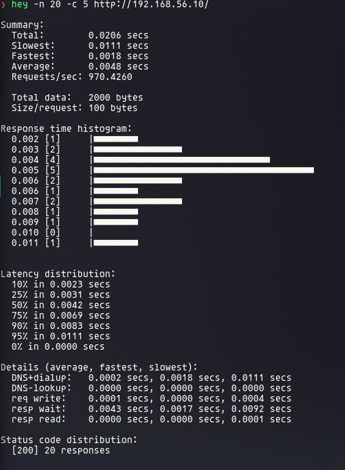

As opções que usamos: `-z` (duração), `-c` (quantos clientes simultâneos) e `-q` (limite de requisições por segundo **por cliente**). No resumo, o que mais olhamos foi a vazão (`Requests/sec`), a latência média (`Average`), o percentil 95 (`95% in`: 95% das requisições responderam até esse tempo) e os códigos de resposta (`[200]` = sucesso).

Um bônus: o `hey` mede a **latência**, que o `stub_status` do Nginx não fornece.

### Os quatro cenários

| # | Cenário | Rota | Duração | Clientes | Taxa |
|---|---------|------|---------|----------|------|
| 1 | Funcionamento normal | `/` | 3 min | 5 | 20 req/s |
| 2 | Aumento de carga | `/carga?n=50000` | 4 × 1 min | 2 → 5 → 10 → 20 | sem limite |
| 3 | Falha de um backend | `/` | 3 min | 5 | 20 req/s, com o `srv-a` parado por ~45 s |
| 4 | Estratégia alternativa | `/carga?n=50000` | 2 min | 5 | sem limite, com peso 3 no `srv-a` |

---

### Cenário 1 — Funcionamento normal

**A pergunta:** com uma carga tranquila, o round robin divide mesmo meio a meio?

🖥️ **PC**
```bash
hey -z 3m -c 5 -q 4 http://192.168.56.10/
```

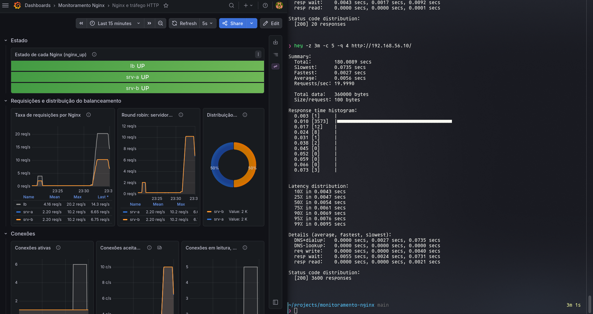
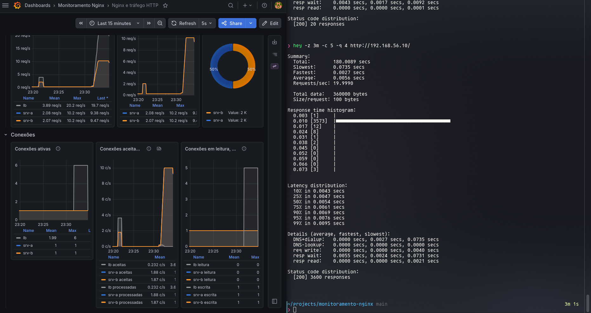
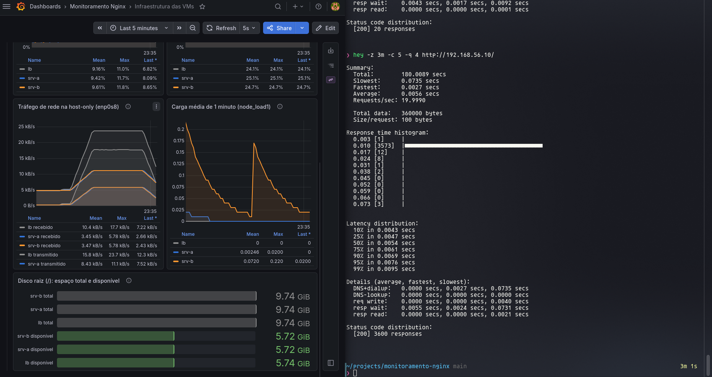

**O que vimos:**
- **3600 requisições, nenhuma com erro**, a 20 req/s. Latência média de 5,6 ms, e 99% abaixo de 9,5 ms.
- O `lb` recebeu ~20 req/s, e **cada servidor ~10**. A pizza fechou em **50% / 50%**.
- A CPU mal se mexeu (~9–12%, quase a linha de base). Para esse ambiente, é uma carga leve.

**Um detalhe curioso nas conexões:** o `hey` reaproveita as próprias 5 conexões (keep-alive), por isso o `lb` quase não abre conexões novas. Já A e B recebem ~10 conexões novas por segundo, uma por requisição. Ou seja, **o `lb` abre uma conexão nova com o servidor a cada requisição**. Isso entrou na lista de melhorias.

---

### Cenário 2 — Aumento de carga

**A pergunta:** o que acontece quando apertamos de verdade?

Aqui usamos a rota `/carga`, que gasta ~40 ms de CPU por requisição, e fomos dobrando o número de clientes a cada minuto.

🖥️ **PC**
```bash
for c in 2 5 10 20; do
  echo "===== concorrência $c"
  hey -z 1m -c $c "http://192.168.56.10/carga?n=50000" | grep -E "Requests/sec|Average|95% in|\[[0-9]+\]"
done
```

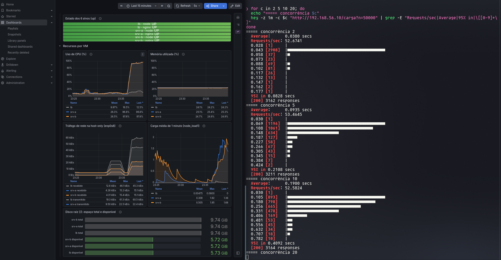

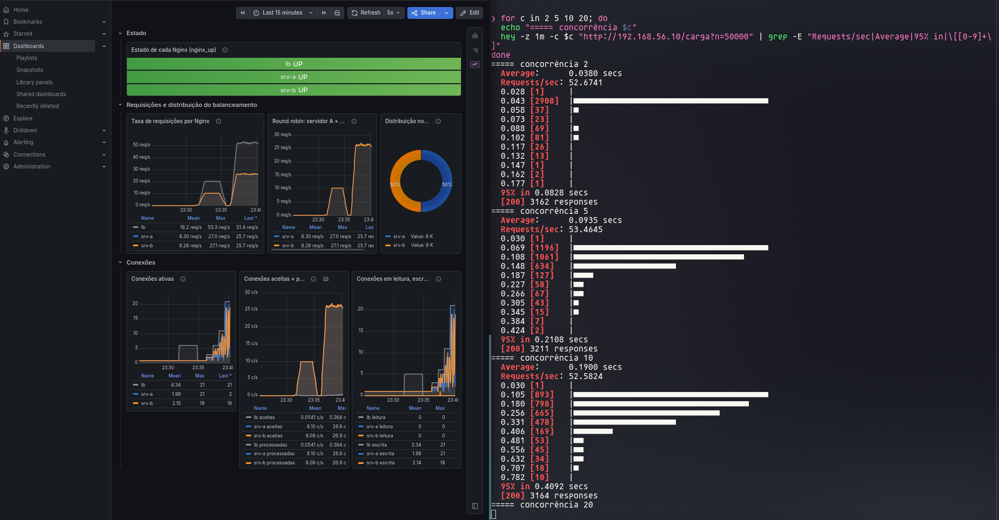
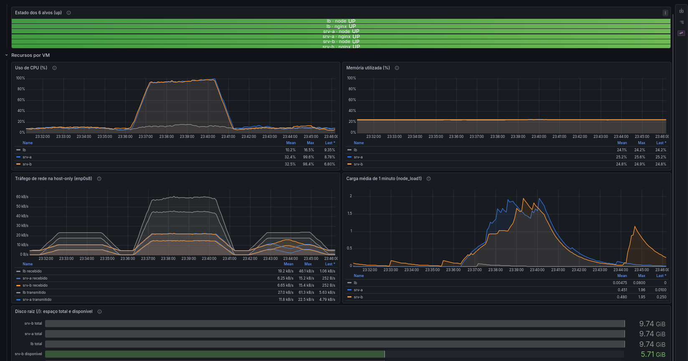

| Clientes | Vazão | Latência média | p95 | Erros |
|----------|-------|----------------|-----|-------|
| 2  | 52,7 req/s | 38 ms  | 83 ms  | 0 |
| 5  | 53,5 req/s | 93 ms  | 211 ms | 0 |
| 10 | 52,6 req/s | 190 ms | 409 ms | 0 |
| 20 | 50,7 req/s | 390 ms | 1,40 s | 0 |

**O que vimos:** os servidores **saturaram já com 2 clientes**. A CPU de A e B foi a ~98% e ficou lá, e a vazão travou em ~53 req/s, uns 26 por servidor.

A partir daí, colocar mais clientes **não aumentou a vazão, só aumentou a fila**: a latência dobrava toda vez que dobrávamos os clientes. Dá até para conferir com uma conta simples (é a chamada Lei de Little), **latência ≈ clientes ÷ vazão**:
- 2 ÷ 52,7 = 38 ms
- 5 ÷ 53,5 = 93 ms
- 10 ÷ 52,6 = 190 ms
- 20 ÷ 50,7 = 395 ms

Os números batem com o que o `hey` mediu.

Com 20 clientes, a vazão chegou a cair um pouco (a CPU passa a gastar tempo alternando entre os processos), e o pior caso disparou: o p95 foi a 1,4 s e o máximo a ~4,4 s.

Outros sinais nos gráficos:
- O `node_load1` de A e B chegou a ~1,9: processos na fila esperando a única CPU.
- As conexões em escrita subiram junto com os clientes: o Nginx fica esperando a aplicação responder.
- A distribuição continuou 50/50 mesmo sob pressão.
- **O `lb` ficou com só ~12% de CPU.** O gargalo eram os servidores, não o balanceador.

E o mais importante: **nenhuma requisição falhou**. O sistema ficou lento, mas não quebrou.

---

### Cenário 3 — Falha de um backend

**A pergunta:** e se um servidor cair no meio do caminho?

Rodamos uma carga tranquila e, no meio dela, desligamos o Nginx do `srv-a`. Uns 45 segundos depois, religamos.

🖥️ **PC** (terminal 1)
```bash
date; hey -z 3m -c 5 -q 4 http://192.168.56.10/
```
📦 **VM `srv-a`** (terminal 2, com o `hey` rodando)
```bash
date; sudo systemctl stop nginx
date; sudo systemctl start nginx
```

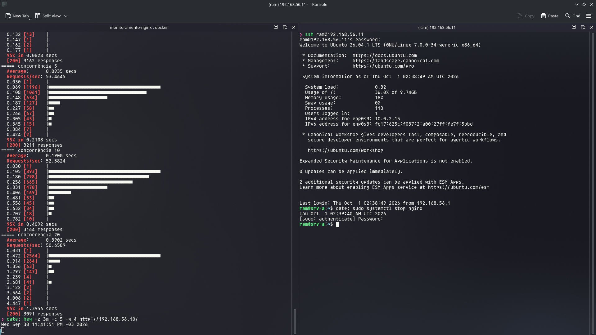

Depois, fomos ver o que o balanceador anotou:

📦 **VM `lb`**
```bash
sudo grep -c "Connection refused" /var/log/nginx/error.log
sudo tail -3 /var/log/nginx/error.log
```

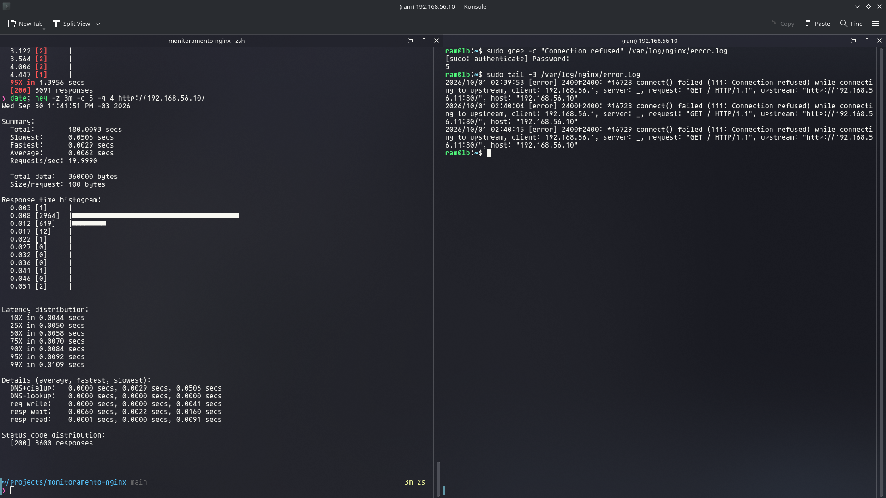
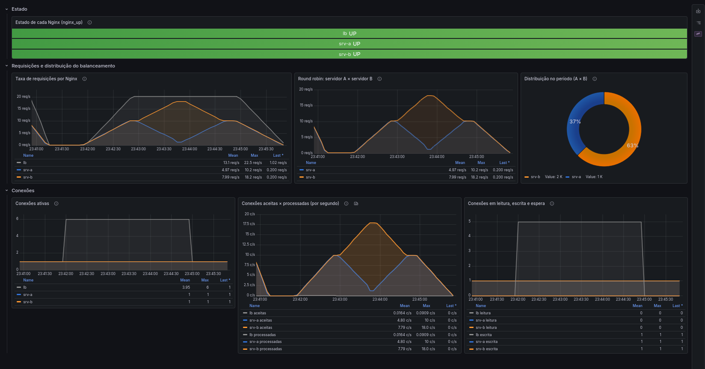

**O que vimos:** **3600 requisições, todas com sucesso.** O cliente não percebeu nada; no máximo, algumas respostas levaram 50 ms em vez de 6.

O B assumiu o tráfego, subindo até 18 req/s, enquanto o `lb` seguiu firme nos 20. Quando o A voltou, a distribuição se reequilibrou sozinha. No período inteiro, a pizza ficou em 37% A / 63% B.

O log do `lb` contou a história com detalhes. Foram só **5 falhas** em ~45 s, espaçadas de **~11 segundos** (02:39:53, 02:40:04, 02:40:15...). O processo foi este:
1. O `lb` tentou o A e recebeu *Connection refused*: não havia ninguém na porta 80.
2. Na hora, reenviou **a mesma requisição** para o B (`proxy_next_upstream`). Por isso o cliente recebeu 200.
3. Tirou o A da rotação por 10 segundos (`fail_timeout=10s`).
4. Passados os 10 segundos, tentou o A de novo. Enquanto ele estava fora, falhou de novo e voltou ao passo 3. Quando ele voltou, funcionou, e tudo voltou ao normal.

**Duas observações honestas:**
- No gráfico, a linha do A **não chega a zero**; ela desce em "V". O motivo é que o `rate(...[1m])` faz a média do último minuto, e a queda durou só 45 s. Uma janela menor mostraria a queda mais nítida.
- Os horários do log das VMs estavam uns 3–4 minutos **atrasados** em relação ao PC, porque as VMs não sincronizam o relógio. Os gráficos não foram afetados, porque usam o horário do Prometheus, que roda no PC.

---

### Cenário 4 — Estratégia alternativa: pesos

**A pergunta:** e se mudarmos a regra de distribuição?

Demos **peso 3** ao servidor A, para ele receber 3 de cada 4 requisições, e repetimos a carga do Cenário 2 com 5 clientes, para comparar com o round robin.

📦 **VM `lb`**: em `/etc/nginx/sites-available/lb`, na linha do `srv-a`:
```nginx
server 192.168.56.11:80 weight=3 max_fails=1 fail_timeout=10s;
```
```bash
sudo nginx -t && sudo systemctl reload nginx
```

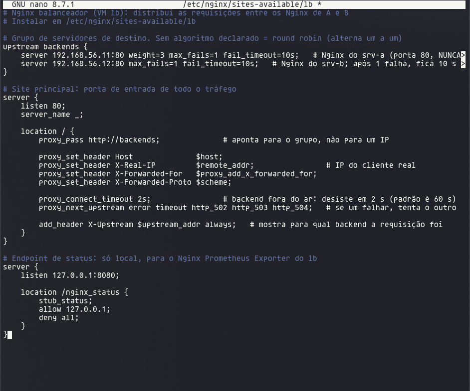

🖥️ **PC**
```bash
for i in $(seq 8); do curl -s http://192.168.56.10/ | grep -o '"servidor": "[^"]*"'; done
hey -z 2m -c 5 "http://192.168.56.10/carga?n=50000"
```

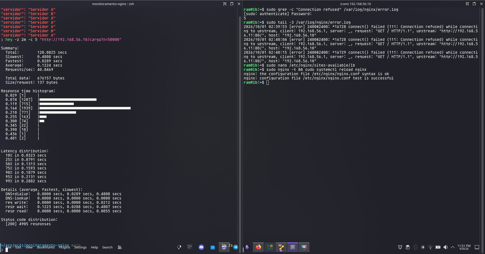
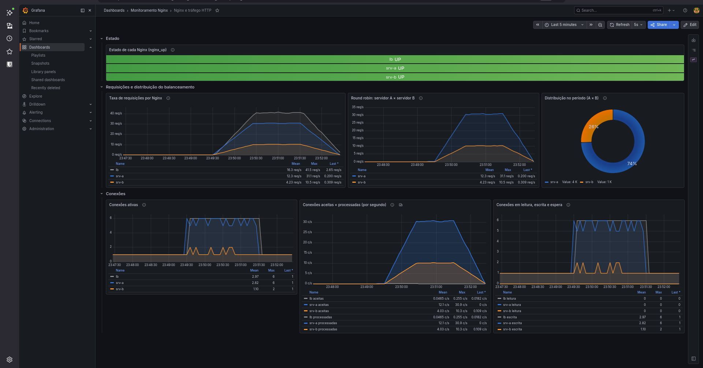
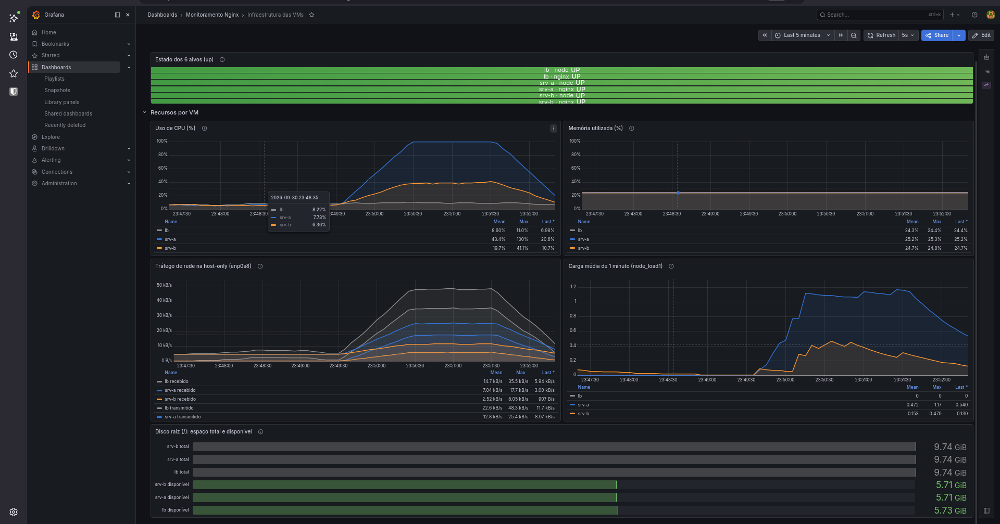

Ao terminar, tiramos o `weight=3` e voltamos para o round robin:

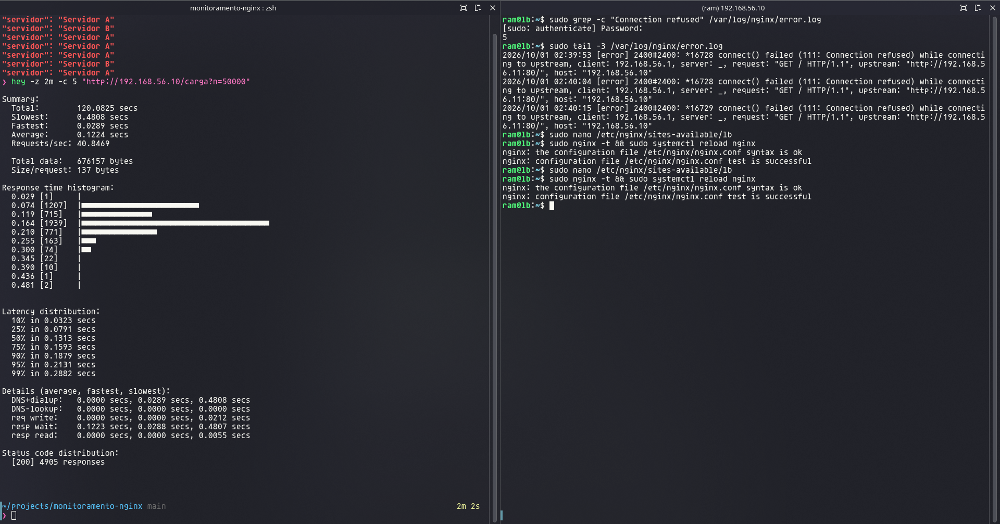

| | Round robin | Peso 3:1 |
|--|-------------|----------|
| Distribuição | 50% / 50% | **74% A / 26% B** |
| Vazão | 53,5 req/s | **40,8 req/s (−24%)** |
| Latência média | 93 ms | **122 ms (+31%)** |
| CPU do A | ~97% | **100%** |
| CPU do B | ~97% | **até 41%** |
| Erros | 0 | 0 |

**O que vimos:** o peso funcionou (A, B, A, A, A, B... e a pizza em 74/26), mas **piorou o resultado**. O A saturou, enquanto o B passou mais da metade do tempo parado. A vazão total ficou limitada pelo que um único servidor aguenta.

**A lição:** peso faz sentido quando os servidores são **diferentes**, por exemplo um com 3 CPUs e outro com 1. Com servidores iguais, como os nossos, o round robin é a escolha certa. Se quiséssemos algo que se adaptasse sozinho, o `least_conn` (manda para quem tem menos conexões abertas) seria a próxima tentativa.

---

## O que aprendemos: resultados, limitações e melhorias

### Resultados

| Cenário | O que esperávamos | O que aconteceu |
|---------|-------------------|-----------------|
| 1. Normal | Alternância e divisão por igual | 50/50, nenhum erro, latência abaixo de 10 ms |
| 2. Aumento de carga | Ver requisições, conexões, CPU e rede reagirem | Servidores saturados a ~53 req/s, latência crescendo junto com os clientes, `lb` folgado |
| 3. Falha | Ver o impacto e a recuperação | O B absorveu tudo, nenhum erro para o cliente, recuperação automática |
| 4. Pesos | Comparar com o round robin | Pior para servidores iguais: −24% de vazão, +31% de latência |

### Limitações que reconhecemos

- O `stub_status` não informa latência, códigos HTTP nem qual servidor respondeu. A latência veio do `hey`, e o servidor só aparece nos cabeçalhos da resposta.
- As leituras do próprio exporter aparecem como requisições (a linha de base de 0,2 req/s).
- A média de 1 minuto do `rate` suaviza eventos curtos, como a queda de 45 s.
- O Nginx Open Source só descobre que um servidor caiu quando uma requisição real falha; não existe uma verificação de saúde ativa (isso é recurso do Nginx Plus).
- O `lb` abre uma conexão nova com o servidor a cada requisição.
- Os relógios das VMs estão dessincronizados, o que complica cruzar logs.
- Tudo roda num único computador: VMs, Prometheus, Grafana e o gerador de carga disputam o mesmo hardware.
- A aplicação é um único processo Python por VM.

### O que faríamos a seguir

| Melhoria | Como | Ganho |
|----------|------|-------|
| Reaproveitar conexões | `keepalive` no `upstream` | Menos latência e menos CPU |
| Latência e erros no Prometheus | Processar os logs do Nginx ou instrumentar a aplicação | Gráficos de latência e de erros por código |
| Gráficos mais "rápidos" | `rate` com janela menor (`[15s]`) | Eventos curtos aparecem com nitidez |
| Alertas | Regras para `up == 0`, `nginx_up == 0`, CPU > 90% | Aviso automático em vez de ficar olhando o painel |
| Relógios certos | `timedatectl set-ntp true` nas VMs | Logs comparáveis entre máquinas |
| Distribuição adaptativa | `least_conn` | Se ajusta quando um servidor fica lento |
| Mais capacidade | Mais vCPUs e mais processos (por exemplo, Gunicorn) ou um terceiro servidor | Aguentar mais antes de saturar |

---

## Por que fizemos assim

Respostas para as perguntas que mais esperamos ouvir.

**Por que NAT + host-only, e não bridge?**
A host-only é uma rede só entre o PC e as VMs, com IPs que não dependem do roteador de casa ou da faculdade. O ambiente funciona igual em qualquer lugar, e as VMs não ficam expostas na rede local. A NAT existe só para as VMs acessarem a internet.

**Por que IP fixo?**
Os IPs estão escritos no `upstream` do Nginx e no `prometheus.yml`. Se mudassem, tudo quebraria.

**Por que 1 vCPU?**
É suficiente para o que roda nas VMs e faz a rota de carga saturar rápido, deixando os efeitos bem visíveis nos gráficos. A e B são idênticos para a comparação ser justa.

**Por que clonar as VMs?**
Para não repetir a instalação. Só tomamos o cuidado de trocar tudo que identifica a máquina: MAC, nome, machine-id, chaves SSH e IP.

**Por que Python sem framework?**
Já vem no Ubuntu e resolve tudo com um arquivo só.

**Por que systemd?**
A aplicação sobe no boot, volta se cair e roda sem privilégios.

**Por que um Nginx em cada servidor?**
O enunciado exige. Além disso, cada Nginx tem seu próprio `stub_status`, o que nos permite medir A e B separadamente e comparar a distribuição.

**Por que o `upstream` aponta para a porta 80 e não para a 5000?**
O balanceador deve falar com os Nginx dos servidores, não com a aplicação. E a 5000 só escuta por dentro de cada VM.

**Como funciona o round robin? Ele muda de servidor quando um fica sobrecarregado?**
Ele percorre a lista em ordem: um para A, um para B, e assim por diante. **Não** olha a carga: no Cenário 2, ficou em 50/50 mesmo com os dois a 98%. Só desvia quando um servidor **falha**. Quem leva a carga em conta é o `least_conn`.

**Por que a porta 80 do `lb` só aceita o PC, e a dos servidores só aceita o `lb`?**
Para liberar apenas o necessário e garantir que todo o tráfego passe pelo balanceador.

**Por que dois exporters por VM?**
Um mede a máquina (CPU, memória, disco, rede) e o outro mede o tráfego HTTP. Com os dois juntos, dá para ver o efeito da carga nos dois lados.

**Por que o `stub_status` fica escondido, mas os exporters ficam na rede?**
O status só é lido pelo exporter da própria VM. Já os exporters precisam ser lidos pelo Prometheus, que está no PC; por isso escutam na rede, com o firewall liberando só o IP do PC.

**Por que Prometheus e Grafana no PC, em Docker?**
O enunciado permite, nada é instalado direto no computador, e tudo fica versionado.

**Por que `network_mode: host`?**
Para o Prometheus sair para as VMs com o IP do PC, o mesmo que o firewall libera.

**Por que coletar a cada 5 segundos?**
O padrão de 1 minuto é lento demais para testes de poucos minutos.

**Por que configurar o Grafana por arquivos?**
Reprodutibilidade: ele sobe pronto, e os arquivos JSON já são a exportação pedida.

**Por que `rate` em alguns painéis e não em outros?**
Contadores só crescem; o `rate` mostra a variação por segundo. Valores instantâneos, como carga ou memória, já dizem o que está acontecendo agora.

**De onde vem a latência, se o Nginx não a fornece?**
Do `hey`, que mede o tempo de cada requisição do lado do cliente.

**Por que a vazão parou em ~53 req/s?**
Cada requisição de carga gasta ~40 ms de CPU, e cada servidor tem 1 vCPU: ~26 por servidor, ~53 no total.

**Por que o cliente não viu erro quando o A caiu?**
Porque o `lb` reenviou a requisição para o B na hora e deixou o A de fora por 10 segundos a cada falha.

**Por que o peso piorou o desempenho?**
Com servidores iguais, o de peso maior satura e o outro fica ocioso.

---

## Tropeços no caminho

Nem tudo funcionou de primeira. Registramos os problemas porque cada um ensinou alguma coisa:

| O que aconteceu | Por quê | Como resolvemos |
|-----------------|---------|-----------------|
| O instalador do Ubuntu quebrou ("An error occurred") | Três VMs instalando ao mesmo tempo | Instalar uma de cada vez |
| "Já existe uma VM com esse nome" ao recriar | A VM foi removida com *Remove only* e a pasta ficou no disco | Apagar a pasta em *Preferences → Default Machine Folder* |
| Confundimos as placas de rede | — | Aprendemos que NAT é `10.0.2.x` e host-only é `192.168.56.x` |
| O nano abriu um arquivo vazio | Faltou o caminho completo do arquivo | Usar o caminho inteiro e o Tab para completar |
| Um `mv` apagou um arquivo | Sem destino, o `mv` renomeia um arquivo por cima do outro | O último argumento é sempre o destino |
| `REMOTE HOST IDENTIFICATION HAS CHANGED` | As chaves SSH mudaram na clonagem | `ssh-keygen -R IP` no PC |
| A aplicação foi parar no `lb` | Terminal conectado na VM errada | Olhar o prompt antes de cada comando |
| O nome saía só "Servidor" | O systemd corta valores com espaço | Aspas: `Environment="APP_NAME=Servidor A"` |
| O `curl` não respondeu logo após o `restart` | A aplicação ainda estava subindo | `systemctl status app` e `curl -v` |
| `ufw: Wrong number of arguments` | Faltou a porta na regra | `... to any port 80 proto tcp` |
| `Protocol "htt" not supported` | Erro de digitação | Seta ↑ para corrigir o comando anterior |
| As respostas do `for` vieram grudadas | Uma `\` antes do `;` | `;` sem barra e `grep -o` para uma por linha |
| Carga alta no `srv-b` sem uso de CPU | Atividade passageira após o boot | Investigamos com `top` e `ps`, confirmamos hardware igual e esperamos estabilizar |
| As legendas dos painéis apareciam cortadas | Painéis baixos demais | Aumentamos a altura no JSON |
| O pacote `hey-bin` do AUR falhou (erro 403) | O link de download não existe mais | Usar o `hey` em Docker |
| `hey: -n cannot be less than -c` | O padrão do `hey` é 50 clientes | Informar `-c` junto |
| Os horários dos logs não batiam | Os relógios das VMs estavam atrasados | Correlacionar pelos gráficos |
| `docker: failed to connect ... docker.sock` | O Docker não sobe sozinho no Arch | `sudo systemctl start docker` e `enable` |

---

## O que foi entregue

| O enunciado pede | Onde está |
|------------------|-----------|
| Ambiente completo e funcional | Etapas 1 a 9 |
| Configuração dos três Nginx | `nginx/backend.conf` e `nginx/lb.conf` |
| `prometheus.yml` | `prometheus/prometheus.yml` |
| Configuração dos exporters | `exporters/prometheus-nginx-exporter` (o Node Exporter usa o padrão) |
| Docker Compose | `docker-compose.yml` |
| Código da aplicação e como executá-la | `app/` e Etapa 4 |
| Dashboards em JSON | `grafana/dashboards/` |
| Prints dos seis alvos UP | `prom-targets.png`, `prom-query-up.png` |
| Prints da distribuição | `lb-round-robin-limpo.png`, `exp1-nginx.png` |
| Prints dos testes de carga | `exp1-*`, `exp2-*`, `exp4-*` |
| Prints da falha de um backend | `exp3-*` |
| Ferramenta, duração e concorrência dos testes | Etapa 10, tabela dos cenários |
| Explicar três consultas PromQL | Etapa 9, "Três consultas explicadas em detalhe" |
| Arquitetura, decisões, dificuldades, resultados, limitações e melhorias | Visão geral, "Por que fizemos assim", "Tropeços no caminho" e "O que aprendemos" |
